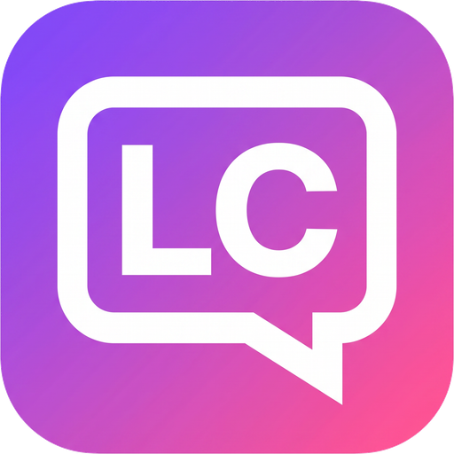

  
  <h1>LC</h1>
  
<strong>A local workbench for supervised, tool-assisted work with LLM models.</strong>

  
LC is built for engineers, researchers, and local-LLM power users.

  

    
    
    
    
    
  

  

    <a href="./docs/getting-started.md">Get started</a> ·
    <a href="./docs/tools/tool-reference.md">Tools</a> ·
    <a href="./docs/security.md">Security</a> ·
    <a href="./docs/README.md">Engineering docs</a>
  

---

## What LC is for

LC is built for work that moves between models, code, papers, local files, and
web sources. It is most useful when you want a model to act—not only chat—but
you still want to choose and inspect what it can do.

- Explore and change code, configuration, logs, and other text-based projects.
- Analyze papers, [PDFs](./docs/tools/tool-reference.md#lc_read_pdf), and
  [images](./docs/tools/tool-reference.md#lc_read_image) with optional vision
  models.
- [Research topics](./docs/tools/tool-reference.md#lc_web_research) across web
  sources and receive cited synthesis.
- Use local and cloud models together in long, multi-step workflows.
- Render Markdown, code, and math, and
  [preview and export diagrams](./docs/diagram-viewers.md).

LC is a workbench, not an autopilot. You direct the task, choose the model, and
decide which capabilities are available.

## Why LC

**Bring your own models.** Connect
[multiple server profiles](./docs/modules.md#multi-server-support) and keep them
active together. LC supports
[OpenAI Chat Completions and Responses, Anthropic Messages, LM Studio, and
compatible endpoints](./docs/getting-started.md#provider-setup). Models from
every active profile appear in one picker. Image analysis, PDF summarization,
and web research can use separate helper models.

**Grant capabilities deliberately.** Workspace provides
[21 fixed tools](./docs/tools/tool-reference.md#tool-catalog) for files, images,
PDFs, shell commands, web research, todos, user questions, whiteboards, skills,
and Tool History. You choose which categories the model can see and
[which operations require approval](./docs/tools/TOOL-POLICY-MODEL.md). File
access is directory-scoped. Shell commands are approval-controlled.
Web Access stays off until you enable it for a conversation.

**See what the model sees.** Inspect the current system instructions, exposed
tools, filesystem roots, grants, generation parameters, and estimated request
context. LC preserves provider reasoning and usage metadata when available.

**Keep long sessions usable.** Optional
[Tool History](./docs/tools/tool-history.md) replaces completed turns' bulky
tool results with small references in future requests. The exact results remain
local and can be retrieved when needed. Todos and conversation whiteboards keep
working state explicit, while
[up to three chats can generate concurrently](./docs/concurrent-conversations.md).

## Local-first boundaries

Conversations, settings, attachments, grants, and custom skills stay in local
storage. LC sends no telemetry, analytics, crash reports, or support reports.
Support reports are generated and previewed locally.

Content leaves the machine when you send a request to a configured model server
or allow a model to use a Web Access tool. Desktop API keys are encrypted locally
and excluded from portable settings exports. User-defined profile request-header
names and values are also excluded. LC removes URL user-info and recognized
credential parameters from queries and structured fragments. The browser
development build has no encrypted credential backend.

Read [Security](./docs/security.md) for the filesystem sandbox, shell controls,
environment scrubbing, network protections, credential storage, and redaction
boundaries.

## Scope

LC is a single-user desktop client, not a model server, IDE, hosted
collaboration service, or unattended autonomous agent.

- The built-in tool set is fixed. MCP is not supported or currently planned.
- PDFs, images, and text formats are supported. Word, Excel, and PowerPoint are
  not.
- Tool calls require a compatible model and protocol. LM Studio's native REST
  profile is chat-only.
- LC has been manually tested and certified on Windows 11, Linux Mint 22.3
  Cinnamon, and Fedora 44 Workstation. GitHub Actions builds the macOS artifacts
  and provides source-level test coverage on `macos-latest`, but it does not
  launch the packaged app. No manual Mac test has been performed, so macOS
  runtime compatibility remains unverified.
- Release binaries are unsigned and un-notarized, so operating systems may warn
  on first launch — one-time approval instructions for Gatekeeper and
  SmartScreen are in [First-launch security
  warnings](./docs/getting-started.md#first-launch-security-warnings).

## Get started

LC connects to model servers you already run or have access to. Follow
[Getting Started](./docs/getting-started.md) to launch LC, add a server profile,
choose the correct API base URL, and enable Workspace tools safely.

For contributors, the [Engineering Documentation](./docs/README.md) maps the
architecture, development commands, behavioral contracts, release gates, and
audit records.

## License

LC is available under the [Apache License 2.0](./LICENSE). See
[NOTICE](./NOTICE) for project attribution.
