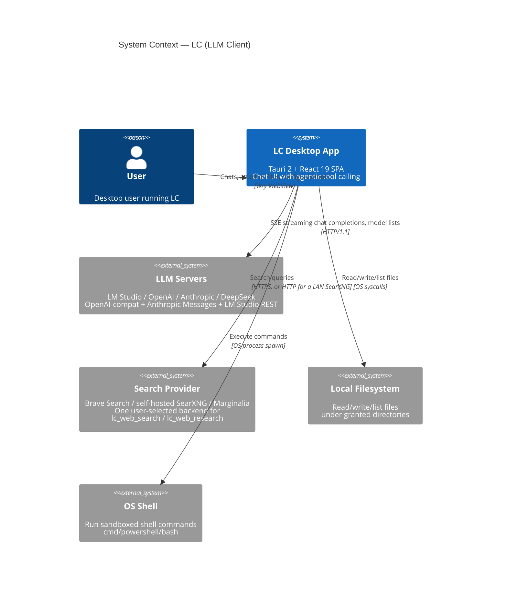
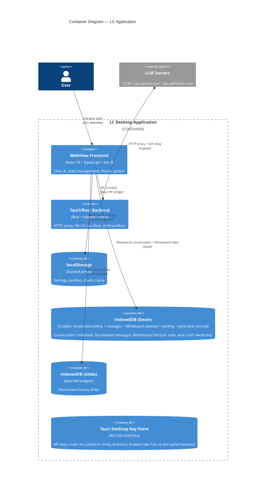
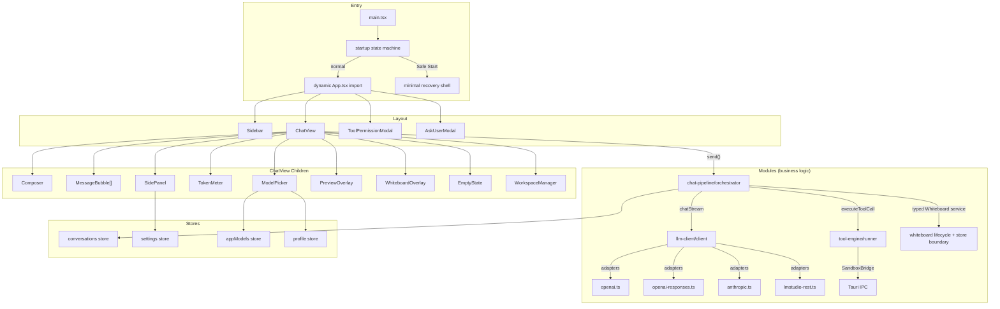
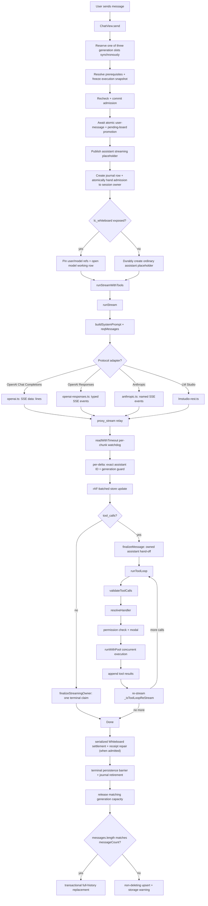

# Architecture

## Runtime overview

| Layer | Technology |
|---|---|
| Interface | React 19, TypeScript, Vite |
| Desktop runtime | Tauri 2 and Rust |
| State and persistence | Zustand, Dexie, IndexedDB |
| Model transport | Streaming SSE with OpenAI, Anthropic, and LM Studio adapters |
| Agent runtime | Concurrent tool batches, bounded tool loops, per-file mutation serialization |
| Native boundary | Canonical path containment, atomic file operations, shell allowlist, network proxy |

The codebase has four modules: LLM client, server profiles, chat pipeline, and
tool engine. See the [module dependency graph](#module-dependency-graph) for
their boundaries and [`modules.md`](./modules.md) for the detailed contracts.

## System Context (C4 Level 1)



## Container Diagram (C4 Level 2)



## Component Tree



### Pre-application startup boundary

`main.tsx` statically imports only React, base CSS, and the dependency-small
`src/startup/` modules. Before loading the normal graph, the packaged Tauri
build reads a bounded local startup marker. It uses `sessionStorage` to
distinguish a new native process from a same-process reload. Then it records
`renderer-created`. It validates only the persisted settings envelope and
dynamically imports `App.tsx`.

The packaged desktop app admits one native process. A second launch focuses the
existing main window before it can create a renderer or advance the startup
marker. This admission boundary prevents a live startup from looking like an
incomplete startup.

`App` opens Dexie and hydrates conversation
metadata. It then completes the remaining phase sequence through `ready`.

The pure state machine owns counter bounds, monotonic and idempotent phase
transitions, retry-token consumption, and malformed-marker fallback. The
browser adapter owns local and session storage. It also owns structured
diagnostic events. Automatic failure counting is disabled outside packaged
Tauri. It is also disabled when the adapter cannot reliably distinguish
launches.

Model discovery, model-catalog synchronization, and auto-archive start only
after the normal startup coordinator records `ready`.

When recovery is selected, LC does not import `App.tsx` or its stores. The Safe
Start graph contains its built-in UI and the startup and platform adapter. It
also contains the existing support-report, redaction, and delivery modules.
Therefore, it cannot hydrate a conversation, discover models, run auto-archive,
or load tools and skills. It also cannot resume generation or repair and retry
an interrupted tool call. Interrupted tool-round repair remains in the normal
lazy conversation-load path.

The recovery surface always loads. If LC cannot import the failure shell chunk,
an inline entry-chunk fallback renders the bounded failure code. It also renders
the last completed startup phase when one was recorded. The fallback prevents
a blank window. It is compiled into the entry chunk and depends only on React.

**Measured boundary caveat.** The source-level boundary holds. `main.tsx`
statically imports only React, base CSS, and the dependency-small
`src/startup/` modules. Both recovery shells load as dynamic chunks. The bundle
artifact does not fully preserve this boundary yet.

A production build includes the `markdown` chunk in the entry chunk's static
imports. The `markdown` chunk includes react-markdown, remark, rehype,
refractor, parse5, and KaTeX. Its raw size is approximately 944 kB. React's CJS
wrappers are defined inside that chunk. Therefore, each launch parses and
evaluates the pipeline before `bootstrap()` selects a mode. This behavior
applies to normal, Safe Start, and Startup Failure launches.

This pre-existing bundling residual is not a source-boundary violation.
Therefore, the boundary is **source-guaranteed but not artifact-guaranteed**.
Re-measure the entry chunk's static imports after a `manualChunks`, dependency,
or bundler change.

## Module Dependency Graph

This overview shows the principal source dependencies. It is not a complete
import inventory or an acyclic dependency rule. Shared projection helpers
create dependencies in both directions between `chat-pipeline` and `llm-client`.

```
┌─────────────────────────────────────────────────────────────────┐
│  UI Layer                                                       │
│                                                                 │
│  ChatView.tsx, SidePanel.tsx, SettingsPage.tsx, ...             │
│    │                                                            │
│    ├─→ modules/chat-pipeline/  (orchestrator, system-prompt)    │
│    ├─→ modules/server-profiles/  (profile store, model store)   │
│    ├─→ modules/tool-engine/  (registry, runner, permissions)    │
│    └─→ modules/llm-client/  (LLMClient factory)                 │
│                                                                 │
├─────────────────────────────────────────────────────────────────┤
│  Module Layer                                                   │
│                                                                 │
│  chat-pipeline/                                                 │
│    ├─→ llm-client/  (LLMClient, adapters, ToolCallAccumulator)  │
│    ├─→ tool-engine/  (HANDLERS_BY_NAME, materialize, runner)    │
│    ├─→ server-profiles/  (profile store, model store)           │
│    └─→ store/  (conversation + Whiteboard lifecycle boundaries) │
│                                                                 │
│  tool-engine/                                                   │
│    └─→ llm-client/  (wire types and native request helpers)      │
│                                                                 │
│  server-profiles/                                               │
│    ├─→ llm-client/  (clients and models.dev enrichment)           │
│    └─→ chat-pipeline/  (generation transport configuration)       │
│                                                                 │
│  llm-client/                                                    │
│    └─→ chat-pipeline/provider-history-projection.ts              │
│        (Anthropic and Responses history projection)              │
│                                                                 │
├─────────────────────────────────────────────────────────────────┤
│  Platform Layer                                                 │
│                                                                 │
│  platform/  (Tauri vs Web adapters — file resolution, keychain) │
│    └─→ (no module dependencies)                                 │
│                                                                 │
├─────────────────────────────────────────────────────────────────┤
│  Store Layer                                                    │
│                                                                 │
│  store/  (Zustand + Dexie — conversations, Whiteboard, settings, │
│  model visibility, response status, tool activity)              │
│  appModels lives in modules/server-profiles, not store/         │
│    └─→ types.ts, utils/, tool-engine grant-state                │
└─────────────────────────────────────────────────────────────────┘
```

## Data Flow (Chat Stream Lifecycle)

LC keeps one foreground `ChatView`, but the process-local generation manager
may own up to three sessions in different conversations. Admission reserves a
slot synchronously before credential/model/Whiteboard preflight. The complete
execution configuration is then deep-cloned and frozen before the durable user
send boundary. Credentials remain in adjacent runtime-only state. Neither the
credentials nor the snapshot enter IndexedDB.



Successful lazy loads derive `messageCount` from the Dexie rows and persist the
reconciliation. An identical retry can repair the count without replacing newer
in-memory message content. Archive export uses the same completeness fact. If a
loader is available, LC reloads an unproven live snapshot from Dexie. Otherwise,
LC rejects the snapshot instead of serializing a truncated archive.

### Whiteboard persistence and lifecycle boundary

`lc_whiteboard` is a pure tool-engine handler. It owns the strict flat schema,
32 KiB validation, read/replace/exact-edit semantics, and stable result issues,
but imports neither React nor IndexedDB. The orchestrator injects a typed
generation-scoped `WhiteboardToolService` through `ToolHandlerContext`. A batch
governor admits at most one Whiteboard call before handler execution. The
service is backed by a serialized lifecycle lane so terminal closure cannot
overtake an admitted model mutation.

The durable boundary spans the conversation metadata, messages, retained
Whiteboard versions, and mutable Whiteboard working rows in the conversation
Dexie database, which currently uses schema v3. User drafts and the one
generation-owned model provisional are the
only replaceable rows. Retained rows are immutable while present. Branch
truncation, archive replacement, conversation deletion, and full wipe can
transactionally remove them. User send promotion and message pinning are one
transaction.

Model admission pins the source user and the initial and latest
model references while it opens the working row.
Each changed model write updates the working content, receipt, and assistant's
latest reference atomically. Whole-transaction collision retry advances a
candidate ID without exposing a partially updated reference.

Every terminal path calls idempotent settlement with the authoritative live
assistant/tool block. Settlement retains the provisional once, deletes the
working row, persists the reconciled messages, and lets a durable receipt
replace a contradictory aborted/error result. If the renderer stops between
those steps, normal lazy load performs the same receipt-driven repair before
generic interrupted-tool recovery. Missing owner messages discard orphans.
Missing retained initial versions fail closed. This behavior makes the retained
row and its compact tool result one recoverable truth boundary.

Whiteboard settlement decodes results through the shared orchestration-notice
decoder. Recognized notices do not turn ordinary success into interrupted work.
If collision repair changes a retained reference, settlement updates framed
success results and preserves their notices and other payload fields.

The overlay reads both histories, heads, pending user state, provisional model
state, and import eligibility from one IndexedDB snapshot. Committed Whiteboard
mutations publish invalidations for live refresh. The standalone package export
captures the two currently visible Markdown documents. Package import takes the
global generation-blocking lease. It rechecks untouched-empty eligibility in
the insertion transaction.

Conversation archive v1 instead exports all
decompressed retained rows in mandatory `whiteboard.json`, never working rows.
Archive replacement, clone/reference remapping, retry/edit truncation, delete,
and full wipe share the appropriate conversation transaction so message pins
cannot outlive their retained rows.

The primary launch action lives in the composer action row immediately after
Attach. A second launch action lives in the standard collapsible Workspace
Whiteboard section between Web Access and Skills. The overlay uses
centered Model/User header tabs, one full-width active board, a fixed centered
version toolbar, and footer package actions. The repository embeds the
`board.svg` geometry in `WhiteboardIcon.tsx`. It has no runtime SVG asset.

The first visible enable, including Workspace re-enable with Whiteboard state
preserved, also takes the global generation-blocking lease. Concurrent settings
requests share the durable initialization, the latest request remains
authoritative, and the lease stays owned through config publication. Therefore,
Send cannot cross initialization with an older disabled config and skip pending
user-board promotion.

### Active-generation configuration boundary

Each generating conversation owns its execution-configuration lock. A
provisional admission covers asynchronous preflight. It rechecks current
capacity and becomes committed immediately before transcript mutation, then
hands off to the streaming owner synchronously with no unlocked gap. Model
selection, parameters, Workspace, tool exposure, and ordinary conversation
actions are locked only for that owner. Unrelated conversations remain
navigable and editable. The immutable snapshot prevents later changes in
another chat from altering an admitted request or its tool re-streams.

Application-wide operations that could invalidate any snapshot remain blocked
while at least one generation or chat admission exists. These include
profile routing/credential mutation, model load/unload and refresh, corpus
import/reset/migration, global security-root changes, and export of a generating
conversation. Store, profile-manager, import, and archive-builder guards enforce
the same boundary as the UI.

Inspection and presentation remain available. The model picker can open and
filter without selecting or loading a model. Display and Appearance remain
editable. Settings section headers can collapse and expand. The side panel
retains **See current system instructions** and **Open Settings > Workspace**.

Workspace categories and directories can also expand and collapse. Every
Workspace and Parameters control that changes configuration is inert.
Whiteboard is the presentation exception: its Workspace section is not muted,
and its disclosure remains usable. Its composer and Workspace launch actions
also remain usable. Its owner tabs, history, export, and User Edit/Cancel/Save
workflow remain usable.

Only the Whiteboard exposure toggle is disabled with the other execution-affecting
controls. Package import remains unavailable while a generation is active.

### Multi-conversation runtime ownership

The consolidated behavior and ownership contract lives in
[concurrent-conversations.md](./concurrent-conversations.md). The bullets below
show how that contract maps onto the application architecture.

- `generation-session-manager.ts` owns controller, phase, TPS, capacity, and
  unread terminal projection by `{conversationId, generationId}`. The default
  is two, and the hard maximum is three. Settings can select one, two, or three
  without a rebuild. A per-profile limiter seam has no limit inside that
  application cap.
- `conversation-ui.ts` owns restart-ephemeral drafts, staged attachment IDs,
  edit state, scroll/follow mode, side-panel and Workspace disclosure state,
  and preview presentation. A bounded LRU evicts only nonresident UI entries.
  Deletion drains lifetime-bearing work and keeps at most 256 recent callback
  tombstones. It also releases that chat's unread terminal projection.
- Resident transcripts are the selected chat plus every conversation with an
  admission, stream, load, branch boundary, deletion, or terminal write in
  flight. Only complete, clean, nonresident transcripts may be evicted.
- Response phase, tool activity, TPS, persistence failures, prompt attention,
  image batches, and request diagnostics are conversation/generation scoped.
  Background completion or failure stays unread until that chat is viewed.
- Permission and ask-user requests share one strict FIFO application queue.
  Ownership is checked at enqueue, visibility, and delivery. Queue wait is
  excluded from a permission call's tool execution deadline. Visible
  permission decision time counts toward that deadline. A sole valid and
  exposed `lc_ask_user` call has no ordinary tool deadline. An independent
  30-minute attention cap prevents an abandoned prompt from occupying
  capacity forever.

## Technology Stack

| Layer | Technology |
|---|---|
| Frontend | React 19 + TypeScript |
| State | Zustand (settings, conversations, profiles, models) |
| Validation | Zod (tool input schemas → JSON Schema for wire) |
| Build | Vite 8 |
| Markdown | react-markdown + remark-gfm + remark-math + rehype-prism-plus + rehype-katex + rehype-raw |

Raw HTML passes through a passive formatting allowlist before `rehype-raw`.
The pass removes raw attributes and literalizes browser-active tags. The image
component renders only inline raster data or an existing blob URL; every other
source uses the guarded-link flow and cannot load during render.
| Tokenizer | gpt-tokenizer (o200k_base estimates) — see [Token counting is hostile-input hardened](#token-counting-is-hostile-input-hardened) |
| Desktop | Tauri 2 (Rust) |
| Rust HTTP | reqwest |
| Rust Async | tokio |
| Rust Serialization | serde + serde_json |
| Rust Hashing | sha2 |
| Rust Errors | thiserror |
| Rust Regex | regex |
| Rust Walk | walkdir |
| Rust Image | image |
| Rust PDF | pdf_oxide (`rendering` feature — pure Rust via tiny-skia) — see [PDF reading is Rust-side and capability-gated](#pdf-reading-is-rust-side-and-capability-gated) |
| Rust Crypto | aes-gcm, rand |
| Rust System | hostname, dirs, base64 |
| Rust Async Utils | tokio-util, futures-util |
| Rust Window Material | window-vibrancy — see [Native window material is resolver-gated](#native-window-material-is-resolver-gated) |

## Native window material is resolver-gated

The window material (opaque, CSS glass, or a native behind-window system
material) is decided in exactly one place and gated before any transparency
can apply:

- `src/platform/material-resolver.ts` is the pure resolver: (platform,
  requested `materialMode`, native-activation result) → a single active
  material (`mica`, `acrylic`, `vibrancy`, `css-glass`, `matte`). Every
  failure path resolves to matte; nothing can resolve to raw transparency.
- `src/platform/material.ts` bridges to the environment: it asks the Rust
  `desktop_platform` command for the compiled target (never
  `navigator.platform`), invokes `activate_window_material` on
  Windows/macOS, and mirrors the resolution to `data-platform`,
  `data-material-request`, `data-material-active`, plus the legacy `.solid`
  class consumed by `src/themes/solid.css`.
- `src-tauri/src/material.rs` owns activation: Mica on Windows 11
  (build ≥ 22000), Acrylic on Windows 10, AppKit `underWindowBackground`
  vibrancy on macOS, matte everywhere else. Every result reports
  success/failure plus a bounded fallback reason.
- Linux uses one opaque-window policy and does not probe individual compositors
  for native blur support. Adding native Linux glass requires capability-based
  compositor integration and runtime validation. See
  [`linux-platform.md`](./linux-platform.md#linux-uses-an-opaque-native-window).
- Root transparency in `src/index.css` applies only when `data-material-active`
  is a confirmed native value; `.app` then paints the `--native-floor` tint
  (theme `--bg` at 90% opacity, gated on `data-base` — see
  `theme/theme-system.md`). The default state — attribute not yet set, Linux,
  web build, any activation failure — is fully opaque.
- Window transparency itself is platform-configured: the base
  `src-tauri/tauri.conf.json` window stays opaque (the Linux invariant);
  `tauri.windows.conf.json` and `tauri.macos.conf.json` replace the window
  array with transparent definitions (macOS adds `macOSPrivateApi`, which
  also rules out Mac App Store distribution).

Two build guards mechanize the invariants: `scripts/check-material-css.mjs`
fails any CSS that makes `html`/`body`/`#root`/`.app` transparent outside a
native gate, and `scripts/check-tauri-configs.mjs` fails when a shared window
field drifts between the three window definitions or the base loses opacity.
The persisted preference migrated from `solidTheme` to `materialMode`
(store schema v2; see `docs/data-model.md`), and the runtime resolution is
echoed into support reports (see `docs/support-report.md`).

## PDF reading is Rust-side and capability-gated

`lc_read_pdf` keeps parsing, extraction, classification, rendering, chunking,
and summary map/reduce in Rust (`src-tauri/src/tools/pdf.rs` and its summary
module). TypeScript validates ranges and hands off separate resolved text and
vision profiles. The native provider builder is shared with image analysis.
Only final public results cross IPC; PDF bytes, page images, and intermediate
summaries remain native.

Calls admit four PDFs and summarize two files concurrently, collecting each
pair in input order. Parsing/rendering runs in `spawn_blocking`, while provider
requests run asynchronously under the shared call deadline. With
`summarize:false`, no model requests run and extracted text is always returned,
even when `include_text:false`. See the [PDF tool contract](./tools/tool-reference.md#lc_read_pdf)
for option combinations and output limits.

The sandbox check remains with every other file tool in
`resolve_under_roots`. Parsing remains off the UI thread.

**The render predicate is measured, not inferred.** An earlier revision used
`AutoExtractor` region kinds (`RegionKind::{Chart, Figure, Table}`). That path
selects `AutoExtractOptions::fast()`. Upstream documentation describes it as
"Text-layer biased, no layout/table work." It returns one full-page `Text`
region for every input.

Therefore, those branches never ran. The enum variants
exist, but that code path does not produce them.

The predicate now measures each signal with a fixture-tested API. It uses
`classify_page`, `extract_images`, `extract_paths`, `extract_tables`, and the
font names from `extract_spans`.

`scripts/gen_pdf_fixtures.py` generates the fixtures in
`src-tauri/tests/fixtures/pdf/` from raw PDF syntax. It uses only the Python
standard library, not `pdf_oxide`. This independence prevents the fixtures from
sharing the tested library's blind spots. Shared blind spots caused the earlier
predicate to pass even though it did not work.

**Only `pdf_oxide`'s `rendering` feature is enabled.** Keep `table-ml` disabled.
It adds `pdfium-render`, which ships one native binary for each platform. This
would remove the pure-Rust property. Keep OCR disabled because it would download
recognition models at runtime.

**Vision capability controls full-depth processing before rendering.** If no
vision model is configured and the chat model cannot see images, JS changes the
call to `text_only`. LC then rasterizes nothing and builds no multimodal
request. Rendered pages go only to the summarizing sub-agent.

LC removes
`data_url` before it persists the tool result. Page rasterization and PNG
encoding occur only in memory. LC does not create converted-page or temporary
PNG files.

## Next-request context uses one provider-history projection

Bubble usage and context prediction are deliberately separate. The assistant
footer owns an already-consumed turn aggregate; TokenMeter predicts only the
active model's next request.
`src/modules/chat-pipeline/provider-history-projection.ts` is the pure shared
selection layer between those surfaces.

For each assistant message it selects the canonical reply/reasoning fields or
provider-native Responses/Anthropic state that the adapter will emit after Tool
History. Responses and Anthropic request conversion consume the same selector,
then re-expand response groups around their matching tool results. TokenMeter
locally counts selected plaintext and adds a bound provider reasoning count only
for a surviving opaque carrier with response-level accounting. A summary beside
encrypted state is not counted twice. Missing opaque accounting and LM Studio's
remote `previous_response_id` state mark the shown numeric total as a known
lower bound and suppress a falsely exact percentage.

Tool History owns only the projection of completed tool calls and results. It
never supplies authority to summarize, filter, or delete reasoning. Reasoning
eligibility is decided independently from provider state, verified provider
provenance, documented portability, and documented request-shape behavior; the
Tool History toggle cannot change that decision. LC archives all
provider-returned reasoning and continuation carriers. Normal history
construction does not compact, summarize, prune, or delete them.

Anthropic provenance records Base URL plus model so LC can enforce a provider
boundary and diagnose origin. It must not become a model-name retention gate:
Anthropic documents passing blocks unchanged across Claude model switches and
letting its API decide which blocks are readable. Cross-provider or unverified
relay replay still requires explicit portability evidence. Carrier
classification is structural and provider-scoped; a model name, endpoint
family, empty display field, or relay hostname is not evidence of encryption.

The complete normative contract, verified provider matrix, and list of current
implementation deviations are in
[reasoning-and-token-accounting.md](./reasoning-and-token-accounting.md). This
section is the architectural summary; it must not grow a second provider/model
capability table.

| Retained provider state | LC classification and accounting | Provider contract |
|---|---|---|
| OpenAI Responses `reasoning.encrypted_content` | Opaque. Use the response's bound `reasoning_tokens` while its encrypted carrier survives. Tool History may rebuild the paired function call without discarding that carrier. | OpenAI documents `encrypted_content` as stateless encrypted reasoning and requires manually managed histories to preserve response output items. See [Responses create](https://developers.openai.com/api/reference/cli/resources/responses/methods/create) and [model guidance](https://developers.openai.com/api/docs/guides/latest-model). |
| Responses-compatible `reasoning.content[].reasoning_text` | Plaintext only when the provider defines the item as chain-of-thought. Preserve the provider-returned item and count its selected wire text locally. The similarly named SSE event is not sufficient classification. | DeepSeek defines this as plaintext; Alibaba documents `response.reasoning_text.delta` as summary output. See the verified provider matrix in the canonical contract. |
| First-party Anthropic `thinking.signature` | Opaque encrypted full thinking. Bind provider-reported reasoning usage to the complete response-level block group; the user-facing label is `Reasoning (reported)`. | See [Thinking](https://platform.claude.com/docs/en/build-with-claude/thinking), [streaming](https://platform.claude.com/docs/en/build-with-claude/streaming), and the [Models API](https://platform.claude.com/docs/en/api/models). |
| Anthropic `redacted_thinking.data` | Opaque and encrypted; never tokenize the payload. | The [token-count request schema](https://platform.claude.com/docs/en/api/messages/count_tokens) requires the original ordered block and describes the data as opaque and encrypted. |
| MiniMax Anthropic-compatible readable `thinking` plus a 64-hex `signature` | Plaintext reasoning plus provider replay-integrity state. Preserve the block unchanged and count `thinking` locally, including through relays. | MiniMax's [Messages response](https://platform.minimax.io/docs/api-reference/text-chat-anthropic) shows complete readable thinking beside the fixed-size signature. |
| DeepSeek Chat Completions `reasoning_content` | Plaintext; count the exact selected wire text locally and pass it back on tool-call rounds. | See the [DeepSeek reasoning pass-back contract](./note-openai-responses.md#8-deepseek-reasoning-pass-back-2026-07-31). |
| Kimi/Moonshot Chat Completions `reasoning_content` | Plaintext; count the exact next-request projection locally. K3 and K2.7 preserve complete history; K2.6 preserves it when `thinking.keep: "all"` is active. | See the [verified Kimi/Moonshot matrix](./reasoning-and-token-accounting.md#55-kimi-moonshot-ai). |
| LM Studio `previous_response_id` | Opaque remote-state handle, not a locally stored encrypted carrier. Occupancy remains unmeasured without an authoritative current-input count. | See [LM Studio native state](./streaming.md#lm-studio-rest-lmstudio-restts). |

Every complete Anthropic block is retained across active and completed turns,
including same-provider model switches. Anthropic may server-filter prior blocks
according to its own compatibility rules; LC does not predict that filtering
from a model name and does not remove the blocks. If the server-side effective
occupancy cannot be measured, TokenMeter shows uncertainty rather than an exact
percentage. No network token-count endpoint runs during render or streaming.

## Token counting is hostile-input hardened

`countTokens` (`src/utils/tokens.ts`) processes **model- and tool-controlled
text** on the render path. This text includes assistant content, reasoning, and
tool output. It runs in the UI process. Two earlier defects caused the app to
fail in this function. Therefore, its guards are necessary.

**The hardened counters are `countTokens` and `countToolDefinitionTokens`.**
`countToolDefinitionTokens` serializes the tool payload and calls `countTokens`.
Therefore, both counters use the same guards. There is deliberately **no
`encodeChat`-based chat counter**. gpt-tokenizer's `encodeChat` requires a model
argument and throws without one. With an argument, it sends an unbroken run to
the BPE merge loop.

If you reintroduce a chat-prompt counter, reuse
`countTokens` sampling. Do not call `encodeChat` on unbounded message content.

**Long whitespace-free runs are bounded before encoding.** BPE cost is
superlinear in the length of one unbroken run. A long token-free string can
freeze the app. Examples include a minified asset, a base64 blob from another
tool, or a shell command that prints one. One whitespace-boundary scan measures
each run once. Runs over 1,024 characters use a 1,024-character token sample.
Do not replace this scan with a fixed `\S{1025}` proof. That pattern retries at
every offset in repeated 1,023- or 1,024-character runs. It caused a 5.9-second
UI-thread block at 8 MiB. Do not use an unbounded `\S{1025,}` match either. V8
can overflow its own regex stack on an 8 MiB run before the tokenizer is called.

**Complete field work also has a fixed cap.** `countTokens` scans and encodes a
field in full through 256 KiB. Above that threshold, it uses eight evenly spaced
2 KiB windows. The tokenizer therefore receives at most 16 KiB for one large
field. This is an estimate, not a worst-case accuracy guarantee. A fixed bounded
sample can miss adversarial density changes outside its windows. Homogeneous
boundary fixtures stay within 2% of full encoding. The committed representative
mixed-density fixture stays within 5%. Provider-reported usage remains
authoritative when it is available.

**Large streamed terminal estimates use canonical segments.** `TokenCounter`
collects visible output and reasoning in separate 512 KiB canonical segments.
It estimates each complete segment with `countTokens` and retains a remainder
smaller than one segment. The terminal estimate is therefore independent of
provider delta boundaries. It does not flatten or tokenize the complete live
field at completion. A 300 KiB ordinary-prose fixture produces the same 51,338
estimate for 1-, 4-, 16-, 256-, and 4,096-character deltas. Full encoding is
51,201 tokens, which makes the bounded estimate 0.27% high.

**Tokenizer sentinels are counted as ordinary text.** `gpt-tokenizer` throws
`Disallowed special token found` on a literal `<|endoftext|>`. A model can write
this literal when it discusses tokenizers. Without handling, this error replaced
the app with the root error screen.

Provider-controlled text could therefore
crash the client. The regression test contains the trigger. It verifies that
the counter matches the literal-mode encoder instead of throwing an error.

Regression tests in `src/utils/tokens.test.ts` cover these guards. They include
the exact production input that froze the app. **Keep this function total.** No
input to `countTokens` can throw or cause unbounded synchronous tokenizer work.
Every caller is on a render path, and the text is untrusted.

## Long reasoning streaming is bounded

Reasoning and visible assistant output are canonical conversation data. Either
field may grow to hundreds of thousands of characters. The UI bounds derived
live work without truncating the stored message:

- `TokenMeter` counts append-only live content from a bounded overlap and
  sample instead of tokenizing the full accumulated field after every append.
  Loaded oversized fields use the stratified bounded sampler.
- `TokenMeter` counts stored assistant reasoning, visible content, and refusal
  independently and simultaneously. Provider `completion_tokens` and cache
  counters are transport diagnostics; their arrival cannot replace or
  redistribute those conversation fields.
- Pipeline terminal usage is exact through 256 KiB when the provider reports no
  usage. Larger streamed fields use the canonical segment estimator. Transport
  chunk sizes therefore do not change the stored or displayed terminal value.
- Reasoning visibility uses a transient append-aware non-whitespace bit.
  Streaming updates inspect only the new delta, and stored messages reconstruct
  the bit once when loaded. Archive snapshots omit it. Render paths therefore
  do not call `trim()` on the complete growing reasoning field merely to decide
  whether to show its UI.
- The reasoning-only loop detector counts characters during its 60-second
  observation grace period but does not normalize discarded pre-arm text.
  Normalization and bounded matching start only when the detector arms.
- `ChunkedMarkdown` re-splits only the unsettled tail of an append-only stream
  while that tail fits the 32,768-character live processing cap. If one
  unfinished block grows past the cap, LC preserves settled chunks and keeps
  only the bounded suffix as a live plain-text candidate. Idle completion does
  one exact split of the canonical field.
- Both live surfaces show a Markdown window of at most 32,768 source
  characters. Settled chunks remain Markdown when the complete stream grows.
- Only the final growing chunk becomes plain text when it exceeds 4,096
  characters. This protects an unfinished fence, table, math block, or long
  paragraph without discarding Markdown from settled chunks.
- Copy continues to use the complete canonical value. The settled assistant
  bubble returns to complete Markdown rendering.
- Request construction and `TokenMeter` share one forward-pass Tool History
  ownership/stub projection. Large combined markers/stubs use the bounded token
  sampler. The meter caches that projection while the prefix stays unchanged
  and overlays only the changing active suffix, so it neither searches nor
  retokenizes the settled prefix for each streamed delta.
- Unarchived tool-call names/arguments and results use the canonical policy
  category. Foundation and Whiteboard have dedicated rows; help, history, and
  skills share a utility row; unknown imported tools use a nonzero-only
  defensive row. Tool material is never charged to Replies.
- The render-owned per-message token memo retains the newest 4,096 message
  identities. A transcript above that count can retokenize older message
  fields on a later render. Archive byte limits do not cap message count, so
  high-count whole-transcript work remains a separately measured residual.
- The to-do snapshot index changes only when the transcript structure changes.
  `ChatView` shares that index with `TokenMeter`; token deltas do not rescan the
  transcript for successful `lc_todo_write` calls.
- The file-change index also changes only with transcript structure. Streaming
  text updates do not rebuild settled tool-result projections.
- Preview rendering and its layout-dependent auto-follow share one throttled
  display cadence. Raw store updates do not independently schedule Markdown and
  scroll work.
- When streaming finishes, any field over 6,400 characters opens as a bounded
  tail with a 6,400-character budget. This also applies when a completed turn
  is reopened from history. LC starts at the first Markdown-safe chunk boundary
  inside that budget; if the final atomic Markdown block alone exceeds the
  budget, LC uses an exact bounded plain-text tail instead of mounting the
  whole block. The user can double the budget to prepend earlier content.
  Closing and reopening the preview resets the budget. Copy still uses the
  complete canonical value, and repeated expansion can show the full settled
  Markdown render.

  That full render
  is not virtualized. Its measurements are separate from the bounded initial
  path.

The reproducible CPU harness is
`node --import tsx scripts/bench-reasoning-stream.mjs`. It selects the A13
conversation from the committed merged archive. That conversation has ~549K
and ~895K reasoning fields. For the deterministic browser path, run
`npm run fixture:providers`. Then send an OpenAI-compatible prompt that contains
`AUDIT_LONG_REASONING`. Use `AUDIT_LONG_REASONING_UNBROKEN` for the 8 MiB
single-block live-splitter case, or append `_HOLD` to keep that stream open for
60 seconds after all reasoning bytes arrive and isolate live work from terminal
reconciliation. Use `AUDIT_LONG_REASONING_BOUNDARY_1024` for the 8 MiB tokenizer
shape made from 1,024-character runs separated by spaces. Unit tests verify
incremental chunk equivalence, the live preview and processing windows, exact
small-field reconciliation, and bounded oversized-field accounting.

**Do not replace these bounds with a throttle alone.** Throttling controls how
often work runs. It does not prevent each run from growing with the complete
prefix. That growth makes the total stream cost quadratic.

Generation UI subscriptions are also conversation-scoped. A TPS or phase
change notifies the selected transcript and the owning Sidebar row. It does not
notify unrelated transcript or row subscribers. Only application aggregates,
such as the active-generation count, subscribe to every session.

## Relative imports carry their own extension

Every relative **value** import in `src/` names its exact file. Use `.ts`,
`.tsx`, or `/index.ts` for a directory barrel. Relative **type-only** imports
stay bare. `npm run check:imports` enforces both halves.

```typescript
import { remainingMs } from '../runner.ts';              // value → extension
import { LLMClient } from '../llm-client/index.ts';      // barrel → explicit index
import type { ToolHandler } from '../types';             // type-only → bare
```

The rule exists because four toolchains resolve these modules and only one is
strict. `node --test --experimental-strip-types`, which runs part of `npm test`,
performs **no** extension or directory resolution. An extensionless relative
specifier is `ERR_MODULE_NOT_FOUND`. `tsx`, Vite, and
`tsc -b` (`moduleResolution: "bundler"` with `allowImportingTsExtensions`) all
accept either form.

When applied to individual modules, that asymmetry marks only files reached by
a Node-phase test. Import chains can then fail one step beyond the previous
change. A uniform convention lets any module enter a Node-phase test without
prior import edits.

Bare type-only imports give the extension a clear meaning. A relative specifier
with an extension loads at runtime. A mixed import is a value import.
`import { CONSTANTS, type Shape } from './x.ts'` still emits a runtime
resolution. Therefore, it uses the extension.

The convention applies only to source. It does not change the bundle. The built
chunk set and content hashes are identical with either form.

## KaTeX version coupling (Temporary note)

The markdown pipeline renders math through `rehype-katex`, which depends on
`katex` as its **own** dependency (pinned to `^0.16.0` as of `rehype-katex@7.0.1`,
the latest). The app also imports `katex/dist/katex.min.css` directly from
`src/utils/markdown.tsx`. Therefore, the renderer and stylesheet must use the
**same** katex version. KaTeX 0.18 renamed its internal CSS classes, for example
`base` → `katex-base`. A 0.16 renderer with 0.18 CSS would render unstyled math.

`package.json` therefore pins both to `^0.18.4` via an npm `overrides` entry for
`rehype-katex.katex`. **The override can be dropped** once a `rehype-katex`
release widens its `katex` range to include `^0.18` or moves `katex` to a
`peerDependency`. Confirm the change with `npm ls katex`. The override is not
needed if one top-level `katex@0.18.x` shows `rehype-katex → katex … deduped`.

`mermaid` and `micromark-extension-math` keep their own bundled
`katex@0.16.x` copies. These copies are self-contained and not affected by this
coupling.

The production font files also remain external assets. Tauri's CSP permits
packaged fonts through `self` and excludes `data:` font URLs. Vite therefore
never inlines WOFF2 files, even below its default 4 KiB threshold. This matters
for `KaTeX_Size3`, which provides the scalable delimiters used by two-row
matrices. `npm run check:katex-fonts` verifies all four KaTeX delimiter fonts
after the production frontend build.
