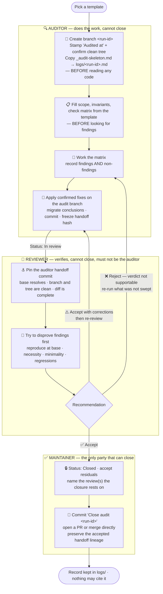

<!--
  Copyright 2026 LC Contributors

  Licensed under the Apache License, Version 2.0 (the "License");
  you may not use this file except in compliance with the License.
  You may obtain a copy of the License at

      http://www.apache.org/licenses/LICENSE-2.0

  Unless required by applicable law or agreed to in writing, software
  distributed under the License is distributed on an "AS IS" BASIS,
  WITHOUT WARRANTIES OR CONDITIONS OF ANY KIND, either express or implied.
  See the License for the specific language governing permissions and
  limitations under the License.
-->

# Audits

An audit is a systematic sweep of one subsystem. It records what was found, what
was fixed, and what was deliberately left. LC **keeps** the records, in
[`logs/`](./logs/), together with the independent review that each one requires.

Keeping the record does not weaken the migration rule. A constraint that lives
only in an audit is a constraint the next change will violate. Every durable
conclusion therefore moves into the document that owns that contract. The
archive is provenance. It shows how a conclusion was reached, what was ruled
out, and who checked it. It does not replace putting the conclusion where it
belongs.

## Identity

A **run code plus the minute the run opened** identifies a run:

```
docs/audits/logs/a06__202608252355.md
                 ^^^  ^^^^^^^^^^^^
                 code yyyymmddhhmm
```

For `A01` through `A15`, the run code is the template code in lowercase. `A16`
is the only exception. It is a family template with fixed semantic subcodes
`a16a` through `a16m`. An A16 run uses one of those subcodes, such as
`a16c__202608252355`. `a16__202608252355` is not a valid run
id. The letter identifies a stable documentation scope. It is not a sequence
suffix.

Use local time, 24-hour, and zero-padded, so `0905`, not `905` or `9:05`. The
minute is what makes the identity self-assigning. Two runs of the same template
on the same day need no coordination and no sequence suffix. The auditor never
has to ask what number to use, and a directory listing sorts chronologically.

There are no sequential audit numbers. The run code and the timestamp are the
whole identity.

A finding is numbered `F-<code>-<yyyymmddhhmm>-<nn>`, such as
`F-a06-202608252355-01`. The finding id carries the run id, so a review and a
closing commit message can name a finding without ambiguity. Inside the record
itself, the short form `F-01` is fine.

For a real run, those two places are the only places that run's finding id may
appear outside its own record. See the next section. Examples in this document
and in historical migration notes are not citations to a live record.

## The audit branch

Every run owns a Git branch named exactly for its run id, with no `.md` suffix:

```
record:  docs/audits/logs/a06__202608252355.md
branch:  a06__202608252355
```

Create the branch before reading code. The branch contains the audit record,
the auditor's remediation, every review, any correction round, and the
maintainer's closure. Nothing from it enters the integration branch until an
independent reviewer has accepted an exact auditor handoff commit and the
maintainer has closed the run.

The branch is containment, not evidence. A branch name moves, so a review never
accepts "whatever is currently on the branch." At each handoff, the auditor
commits the record and all remediation, stops changing the branch, and gives the
reviewer the full commit hash. The reviewer records that hash in the review and
checks the complete `Audited at...handoff` diff. Corrections produce a new
handoff commit and require another review round. A prior acceptance never
carries forward to a different hash.

Open the audit branch from a clean tree. If the current worktree contains
unrelated changes, create a separate clean worktree at the intended base instead
of carrying those changes onto the audit branch. This keeps `Audited at` and the
reviewed diff reproducible.

## The archive is a leaf

**Nothing outside `logs/` may reference a record inside it.** This covers
references by path, by link, by run id, and by finding id. It applies to a
contract document, to the project README, to a docstring, and to a test name.

A **record** is an audit file or a review file, such as `a06__202608252355.md`
or `a06__202608252355__review__qwen3.6max.md`. Those are what nobody may cite.

Two things are not records, and anyone may link to them like any other document:

- **[`logs/`](./logs/) itself**, as an index.
- **[`logs/README.md`](./logs/README.md)**. It is ordinary documentation that
  describes the archive, not a dated record, and LC never prunes it.

Records may reference each other freely *inside* `logs/`. An audit names its
reviews, and a review names its audit.

There are **two operational exceptions**, neither of which is a contract
citation:

- The live audit branch is named for the run id while the run is open, under
  review, or awaiting closure. Delete the branch after integration. Code,
  documentation, tests, and other branch names still may not cite the record.
- The closing commit message names the run id and its findings. Nothing may link
  to the record, so `git log` is the only durable index of what a closed audit
  did. That is why the format below requires findings to be spelled out instead
  of cited by number. A commit body must survive the record being pruned. Git
  history does not go stale, and a reader does not have to resolve a link from
  it, so it does not create the dependency this rule prevents.

The reason is the whole point of keeping the archive. A record that nothing
depends on can be superseded, pruned, or rewritten without breaking anything.
The moment code cites `F-a06-202608252355-03`, that record becomes a contract
document with none of the maintenance a contract document gets. Removing it then
turns into a migration.

This is the `release-readiness.md` lesson inverted. Code and documentation both
cited that file, so deleting it required repointing every inbound reference
first. The archive must never accumulate that gravity.

**The corollary is the useful part: if you want to cite it, migrate it.** The
urge to reference a finding is the signal that nobody moved its conclusion into
the document that owns that contract. Move it, and cite *that*.

> **Historical migration example.** A previous corpus-wide docs-sync sweep found
> source comments and test names that still cited retired post-mortems. Someone
> migrated those references, so each one now states its conclusion inline or
> points at the owning contract document. If another appears, apply the same
> migration. Do not restore a dependency on an archived record.

`A16` checks this. See its invariant 8.

## Roles and the cycle

There are three roles, and **the separation is the point**. The party that did
the work does not get to declare it sound.



**The two arrows back to the auditor are the whole reason the cycle exists.** A
review that can only say yes is a rubber stamp. `Reject` returns the audit to
the matrix. `Accept with corrections` returns it to remediation, and it then
comes back through review again.

| Role | May | May not |
|---|---|---|
| **Auditor** | Run the matrix, record findings and non-findings, apply fixes, migrate durable conclusions, update the record | **Close the audit.** Review their own work |
| **Reviewer** | Independently verify any claim, re-derive numbers, record review findings, recommend a verdict | **Close the audit.** Edit the audit record. Be the auditor |
| **Maintainer** | Close the audit, accept residuals, waive nothing silently | — |

### What each role actually owns

**Auditor — produces the evidence.** The auditor owns everything from creating
the run branch and stamping `Audited at` to migrating the durable conclusions.
The auditor applies confirmed fixes on that branch, because the fixes are part
of the audit, not a follow-up. The branch makes rejection cheap; it does not
make a speculative change correct. The one thing an auditor cannot do is judge
their own work. An auditor who could close would be marking their own homework.
The failure mode is not dishonesty. It is blindness, because you cannot
re-derive a number you just read. You already believe it.

**Reviewer — tests the checking and the necessity of the change.** The
reviewer's first question is whether each reported defect was real at `Audited
at`, not whether the remediation looks plausible. Try to disprove the finding,
identify the contract that makes the old behavior wrong, reproduce the failure
against the base, and confirm concrete impact. Then ask whether the change was
necessary, minimal, and bounded to that failure. Re-derive from source instead
of re-reading the record, confirm that the audit swept its declared scope, run
the auditor's scripts against inputs whose answers are known, and verify that
each justified fix and its documentation followed. A passing test on the fixed
branch does not establish that the old code was defective.

At LC's current maturity, false positives and unnecessary remediation are
primary audit risks. Zero product findings and zero review findings are valid
successful outcomes. Neither role is evaluated by the number of defects it can
name. A plausible concern, an unreachable theoretical hazard, and an
opportunity to refactor are not findings.

A reviewer recommends. A reviewer never edits the record, so review findings
stay attributable, and the auditor stays accountable for the response. The
reviewer commits only their review file to the audit branch; that metadata
commit does not change which auditor handoff hash was reviewed.

**Maintainer — accepts the risk.** Closing is not an administrative flip. It is
the moment someone takes on the residuals, the unexercised platforms, and the
"what this audit does not claim" section. That is why closing cannot be
delegated to the party that wrote either document. The closing commit is the
maintainer's own record of the decision. Closure means the maintainer approves
the exact accepted lineage for integration. If they are still deciding whether
the changes should land, the audit is not ready to close.

**One person can hold two of these roles, but never auditor and reviewer.** On a
small team it is normal for the maintainer to review someone else's audit and
then close it, because the independent check happened. If the *maintainer* ran
the audit, someone else must review it. The maintainer still closes, but on a
review they did not write.

**Every audit requires at least one independent review** before anyone can close
it. The review is a separate file beside the audit:

```
docs/audits/logs/a06__202608252355__review__qwen3.6max.md
```

Write one file per reviewer, named for the reviewer. More than one review is
welcome. Zero reviews is not a closeable state. Write the review from
[`_review-skeleton.md`](./_review-skeleton.md).

## Writing requirement

Auditors and reviewers must follow
[`skills/lc_skill_ste100.md`](../../skills/lc_skill_ste100.md) in pragmatic
mode. This requirement applies to all technical prose that they add or change.
It includes findings, non-findings, evidence notes, remediation text, review
findings, recommendations, and documentation updates.

The audit and review skeletons remain the required record formats. The writing
guideline controls the prose inside those formats. Preserve technical literals,
facts, conditions, scope, uncertainty, and requirement strength. Use one term
for each concept. Do not convert a recommendation into a requirement.

Complete the guideline's self-check before each auditor handoff and before each
review commit. Do not claim official or certified ASD-STE100 compliance. LC uses
a structural, ASD-STE100-inspired guideline without the official dictionary.

The reviewer checks the auditor's changed prose for ambiguity and inconsistent
terms. A writing problem is a review finding only when it changes meaning,
weakens evidence, or makes an instruction unsafe or unclear. Do not request
style-only rewrites, and do not rewrite correct text to make the review look
productive.

## Running one

1. Pick a template from the table below. For A16, also select one fixed subcode
   from its template before the branch opens. If your question spans two
   templates or two A16 subcodes, run separate audits. Keep each run within one
   declared boundary so its evidence stays focused.
2. Assign the run id from the minute the run opens. From a clean tree, create
   the branch with that exact name and no `.md` suffix, such as
   `git switch -c a06__202608252355`. **Before copying the skeleton or reading a
   line of code**, capture `Audited at` with `git rev-parse HEAD`, confirm the
   branch with `git branch --show-current`, and confirm a clean tree with `git
   status --porcelain`. If the current worktree is dirty, use a separate clean
   worktree at the intended base.
3. Copy [`_audit-skeleton.md`](./_audit-skeleton.md) to `logs/<run-id>.md`, and
   paste the branch, hash, and clean tree state you just captured. Every
   `file:line` you go on to cite resolves against that commit. A hash captured
   after the fixes describes a tree in which some of your own findings no
   longer reproduce. Never update the stamp afterwards.
4. Record the template as `ANN v<ver>` in the header. An A16 subrun records the
   shared template as `A16 v<ver>` and its selected subcode in §1. Then fill in
   the scope, the invariants, and the check matrix from the template, *before*
   you look for findings. Deciding what "correct" means after seeing the code
   is how an audit talks itself out of a defect.
5. Work the matrix. Record non-findings as you go. A clean audit is a useful
   result; never promote a hypothesis to make the run look productive.
6. Migrate every durable conclusion into the document that owns that contract,
   and apply only confirmed fixes on the audit branch. Do not perform
   opportunistic cleanup, speculative hardening, or an adjacent refactor. A
   behavior-changing or architectural proposal whose necessity is not proven
   is deferred for a maintainer decision, not implemented as an audit fix.
7. Set `Status: In review`, commit the completed record, fixes, tests, and
   documentation, stop changing the branch, and hand the full commit hash to an
   independent reviewer. The
   reviewer writes `logs/<run-id>__review__{reviewer}.md`, using the audit's
   timestamp, not the review's. The reviewer checks the exact
   `Audited at...handoff` diff, records the handoff hash, and commits only the
   review file to the audit branch. **This step can send the audit back.**
   `Reject` returns it to step 5, and `Accept with corrections` returns it to
   step 6. The auditor commits corrections and creates a new frozen handoff;
   the reviewer records and checks that new hash. Only `Accept` reaches step 8.
8. The **maintainer** closes it. The maintainer confirms that the accepted hash
   is the latest auditor handoff in the branch lineage and that only review and
   closure metadata follow it. The maintainer sets `Status: Closed`, accepts the
   residuals, records which review or reviews the closure rests on, and commits
   under the standard message below. They then integrate the branch directly or
   through a pull request, following the gate below.

Step 6 produces the lasting product value. Step 7 is where an independent party
decides whether that value is real or whether the branch contains an
unnecessary change. Containment makes rejection recoverable; review makes
integration earned.

### Maintainer integration gate

Closure approves an exact reviewed lineage for integration. It is not a marker
that the maintainer may begin deciding whether the changes should land. Before
closing, the maintainer must confirm all of the following:

- The final recommendation is `Accept`, it names the full auditor handoff hash,
  and that hash descends from the audit's `Audited at` commit.
- The accepted handoff is the latest auditor-produced product state. After it,
  the branch contains only the review file and maintainer-owned closure metadata
  — no code, tests, contract documentation, generated content, or remediation
  changes.
- The residuals, unexercised platforms, deferred findings, and §10 limits are
  understood and deliberately accepted.
- The maintainer intends to integrate this exact lineage. If they want a
  finding removed, a fix changed, or the work left unmerged, they send the audit
  back before closing.

After the closing commit, the maintainer may merge directly or create a pull
request. The pull request is a delivery and integration mechanism; it is not a
substitute for the independent audit review. Preserve the reviewed commits with
a fast-forward or merge commit. Do not squash or rebase after review: rewriting
the lineage makes the recorded handoff and its reproducible base unreachable.

A clean CI run, ordinary PR discussion, and a conflict-free merge do not require
another audit review. Any PR feedback, conflict resolution, generated update,
or other change that alters code, tests, contract documentation, remediation,
or the audit's conclusions does. In that case the existing closure no longer
applies: return the audit to `In progress`, record why it reopened in §11,
produce and commit a new auditor handoff, obtain `Accept` for that exact hash,
and close again before integration.

After integration, verify that the closing commit and accepted handoff remain
reachable from the integration branch. Only then delete the audit branch.

### When the investigation came first

Debugging, incident response, and ordinary feature work sometimes uncover an
audit-worthy failure mode before anyone opens a formal run. **Do not backfill an
audit record after reading or changing the code.** A late stamp cannot describe
the pre-fix tree. Calling the investigation an audit would also bypass the scope
declaration and the independent-review boundary above.

Handle that case explicitly:

1. Land the fix with its regression test, with a reproducible benchmark or
   fixture, and with the living contract documentation it changes.
2. If the work exposed a missing template invariant or matrix axis, improve the
   template. Follow the versioning rules below if a closed run has already used
   that template. An unused template stays at `1.0`.
3. If a formal verdict is still useful, a new auditor opens a fresh run against
   the current tree. Pre-fix measurements can be supporting evidence. The
   audit's claims and citations stay anchored to the stamped current commit.

This preserves the useful lesson. It does not manufacture provenance that the
process did not produce.

## Every audit carries its own documentation

Every domain audit that changes code can falsify a document. Handle that
**inside the audit that made the change**. Do not schedule an A16 subrun
afterwards.

- **The auditor** records one row per code change in `§8.1 Documentation
  impact`. The row states what changed, which documented behavior it affects,
  and which document or docstring was updated. `none — internal only` is a
  common and valid row. The update lands in the **same change** as the fix.
- **The reviewer** verifies that column in `§10 Fix verification`, bounded to
  the surfaces the audit touched. This includes testing whether each
  `none — internal only` claim survives a grep.

**Updating a document is not the same operation as finding the old claim.**
Writing a correct sentence where you are already working leaves every *other*
sentence asserting the old behavior exactly where it was. Those sentences are in
files the audit never opened, so nothing prompts you to look, and no mechanical
check can see them: the links still resolve and the paths still exist. The
document is now confidently wrong, which is worse than silent.

So for each behavior an audit changes, grep the corpus for prose describing the
behavior it replaced, not only for the identifier it touched. Search for the old
promise in the words a reader would use. A guard that now refuses something is
the common case: find every sentence that still says the tool accepts it. Record
what you searched for in `§8.1`, so the reviewer can repeat it.

**You do not run an A16 subcode after every audit.** Each A16 subrun combines a
corpus-wide mechanical sweep with a deep semantic review of one fixed claim
family. Links, anchors, cited paths, orphans, and archive leakage are global.
Behavioral truth is scoped by `A16a` through `A16m`. "All documentation" is not
a completable semantic audit.

This boundary matters because an unscoped `A16` can be larger than `A01` and
still produce weaker evidence. Running it to catch three changed lines is also
expensive, and it is *late*, because the drift is already committed by then.
The fix and its document belong in one change. That is the same rule that makes
deleting a document a migration rather than a deletion.

An A16 subcode earns its own run when one of these is true:

- A release is approaching, or enough ordinary development has accumulated that
  corpus-wide drift is plausible. A release gate may require separate A16
  subruns for several high-risk claim families. It does not turn one subrun
  into an all-document semantic audit.
- Someone is removing a document or reorganising a directory, so inbound
  references must be repointed first.
- An audit records a documentation impact it could not assess, and hands it on
  deliberately as a residual.
- The archive-leakage check is due. Nothing outside `logs/` may cite a record,
  and only the A16 family checks that.

## The closing commit

Nothing may link to a record, so **`git log` is how a closed audit stays
discoverable.** The commit message is therefore not a pointer to the summary. It
*is* the summary, and it has to stand on its own.

Use this subject line exactly:

```
Close audit <run-id>
```

For example, use `Close audit a06__202608252355` for a standard run and `Close
audit a16c__202608252355` for a Whiteboard documentation run. The prefix is
fixed, so the whole history is one query: `git log --grep='^Close audit'`.

Use this body:

```
One paragraph: what the audit checked, on which build, and the verdict in
plain terms.

Findings: 6 — 4 fixed, 1 deferred, 1 withdrawn.
Review: a06__202608252355__review__qwen3.6max.md — Accept.
Accepted handoff: <full commit hash reviewed and accepted>.

Migrated:
  <conclusion> -> <the document that now owns it>

Fixed:
  F-01  <what changed, one line>
  F-03  <what changed, one line>

Deferred:
  F-04  <what, and why not now>

Accepted on closure:
  <what the maintainer is taking on — residuals, platforms not exercised,
  edits that were not compiled or run>
```

For an A16 subrun, add this structured line after the opening paragraph:

```
A16 subcode: A16c — Whiteboard tool, policy, lifecycle, storage, archive,
package, UI, recovery, security, privacy, and accessibility claims.
```

Use the exact subcode and scope text from the A16 template. This line makes the
last accepted coverage for each subcode discoverable through `git log` after
the branch and records are gone.

Six rules make the body worth writing:

- **Name every migration and its destination.** This is the audit's only lasting
  output, and it is the one line a future reader most needs.
- **Spell findings out.** `F-03` alone is unreadable once the record is gone,
  and by this document's own rule nothing may link to the record to resolve it.
- **"Accepted on closure" is not optional.** Closing is the act of accepting
  residual risk. If that line is empty, write `none` deliberately instead of
  leaving it out.
- **Pin the accepted handoff.** A branch name moves and may be deleted after
  integration. The full hash says exactly which auditor state the review
  accepted.
- **Preserve the reviewed lineage.** Integrate with a fast-forward or merge
  commit. A squash or rebase makes the accepted handoff unreachable and breaks
  the provenance the closing body claims to preserve.
- **No link to the record.** Name the review file as text, as shown above. Never
  name it as a path or as a markdown link.

The closing commit normally carries only the status flip and closure metadata,
because the fixes, migrations, and review already landed on the audit branch.
The body still describes the whole run.

## Templates and skeletons

Every template carries a **code** and a **version**. Codes are stable
identifiers, never reused and never reassigned. A run is identified by its code
and timestamp, so reassigning a code would silently rewrite the history of every
audit filed under it.

The code is also the filename prefix, `aNN-<slug>.md`, in lowercase, so the
directory listing sorts by code. Write the code itself in uppercase in prose and
in headers, such as `A05`. Template filenames are lowercase, matching the other
files in `templates/`. A16 subcodes are the documented exception. They are
stable run codes under the single `A16` template, not extra template files.

| Code | Template | Ver | Covers |
|---|---|---|---|
| `A01` | [tool-surface-and-contracts](./templates/a01-tool-surface-and-contracts.md) | 1.0 | Tool schemas, descriptions, typed guidance and recovery, help results, model-visible text, semantic field ownership, meaningful empty strings, payload budgets, Whiteboard ownership, result and error contracts |
| `A02` | [tool-loop-and-concurrency](./templates/a02-tool-loop-and-concurrency.md) | 1.0 | Pairing, admission order, repeat and duplicate-ID semantics, result framing, generation-scoped image delivery, interaction FIFO, application file/shell coordination, help and Whiteboard governors, permission scope, exactly-once execution |
| `A03` | [protocol-adapters](./templates/a03-protocol-adapters.md) | 2.0 | Exact provider-contract resolution, wire correctness per envelope including Gemini Interactions, controls, reasoning carrier/history/replay semantics, SSE provenance, usage normalization and accounting relationships, embedded-registry source rules |
| `A04` | [streaming-and-turn-lifecycle](./templates/a04-streaming-and-turn-lifecycle.md) | 1.0 | Provisional and committed chat admission, exact-owner handoff, concurrent session ownership, capacity policy, targeted abort, terminal transitions, live/terminal meter reconciliation, next-request projection, multi-response turn usage, timeouts/attention, background status, application exit, Whiteboard repair, canonical-versus-projected state |
| `A05` | [state-and-persistence](./templates/a05-state-and-persistence.md) | 1.0 | Storage invariants, per-conversation lanes/revisions/tombstones, generation journal and recovery, UI/blob ownership, archive/clone/import races, bounded result framing, immutable Whiteboard versions and atomic package import |
| `A06` | [cpu-and-responsiveness](./templates/a06-cpu-and-responsiveness.md) | 1.0 | Hot paths, append-only growth, hostile input, multi-stream render/subscription fan-out, foreground responsiveness, main-thread blocking |
| `A07` | [memory-and-lifetimes](./templates/a07-memory-and-lifetimes.md) | 1.0 | Sessions, waiters, conversation residency/UI state, shared model-detail work, generation-scoped image caches, three-chat soak, object URLs, relay teardown, Whiteboard/package lifetimes, retained-history growth |
| `A08` | [build-and-runtime-parity](./templates/a08-build-and-runtime-parity.md) | 2.0 | Packaged vs dev behavior including native Gemini, concurrent native relays and targeted cancellation, capacity/settings parity, command wrappers, generated resources/skills, embedded provider-contract placement, artifact contents |
| `A09` | [theme-and-visual-parity](./templates/a09-theme-and-visual-parity.md) | 1.0 | Glass/solid parity, tool and Whiteboard surfaces, multi-conversation Sidebar status/action geometry, compact activity rings, terminal symbols, token discipline, semantic status, motion |
| `A10` | [overlay-and-input-ownership](./templates/a10-overlay-and-input-ownership.md) | 1.0 | Overlay stack, dismissal and focus, cross-conversation permission/Ask User FIFO, target-scoped shortcuts, conversation UI-state ownership, Whiteboard/Preview exclusion, fail-closed edits, scroll ownership |
| `A11` | [security-and-sandbox](./templates/a11-security-and-sandbox.md) | 1.0 | Path escape, exposure and grant scope, name correction, result-framing injection, allowlist, env scrubbing, SSRF, cancellation, Whiteboard ownership, and bounded package validation |
| `A12` | [privacy-and-redaction](./templates/a12-privacy-and-redaction.md) | 1.0 | Support reports, identity-free recent-request/session/phase/image-cache diagnostics, archives, interactive answers, to-do and Whiteboard projections, request replay, export boundaries, bounded vocabulary, digests |
| `A13` | [startup-and-recovery](./templates/a13-startup-and-recovery.md) | 1.0 | Startup graph isolation, Safe Start, markers, bounded retry, non-destructive recovery, and normal-load Whiteboard repair boundaries |
| `A14` | [profile-model-and-credential-lifecycle](./templates/a14-profile-model-and-credential-lifecycle.md) | 1.0 | Profile/model identity, shared discovery/cache cancellation, overrides, credentials, exact provider-contract inputs and immutable resolved identity, complete execution snapshots, invalidating mutation guards, per-profile limiter |
| `A15` | [accessibility-and-assistive-tech](./templates/a15-accessibility-and-assistive-tech.md) | 1.0 | Semantics, background chat status and targeted actions, capacity refusal, prompt identity, preview/Whiteboard keyboard workflows, focus, announcements, contrast, 200–400% zoom, motion, assistive technology |
| `A16` | [docs-code-sync](./templates/a16-docs-code-sync.md) | 1.0 | Family template with runnable subcodes `A16a`–`A16m`. Each subrun checks one fixed documentation claim family plus corpus-wide links, anchors, cited paths, orphans, and archive leakage |

### Which is which

The layout says it. Skeletons sit beside this README, templates live in
`templates/`, and records land in `logs/`.

```
docs/audits/
├── README.md              ← the system: identity, roles, cycle, rules
├── _audit-skeleton.md     ← shape of an audit record   — copy me
├── _review-skeleton.md    ← shape of a review record   — copy me
├── templates/             ← what to check, one file per domain
│   └── a01…a16-<slug>.md  — read one, fill the skeleton from it
└── logs/                  ← the records themselves, plus their reviews
```

| | What it is | You |
|---|---|---|
| **Skeleton** | The *shape of the record*: which sections exist, and in what order | **copy** one |
| **Template** — `a01`–`a16` | *What to check* in one domain: its invariants, check matrix, and evidence rules. A16 also defines its runnable subcodes | **read** one, and fill the skeleton from it |

The `_` prefix keeps the two skeletons together. It also marks them as forms to
copy, rather than documents to read.

The two are versioned independently, because a bump means something different in
each. A **skeleton** bump changes how a record is written. A **template** bump
changes what a verdict means. Both skeletons are currently **1.2**.

### Keep template boundaries synchronized

A behavior can touch several templates, and it still needs one primary owner.
The primary template carries the detailed invariant and the evidence. Siblings
state only the boundary they must preserve.

When a template changes:

- Inspect every sibling named by its `In`, `Out`, or `Siblings` sections for a
  stale boundary or a missing hand-off.
- Update the `Covers` summary above, so template selection still routes an
  auditor to the right owner.
- Add a cross-template matrix case only where the subsystem interface is itself
  under test. Do not duplicate a whole audit in two templates.
- Apply one version decision to the semantic change. Do not treat each wording
  edit as an unrelated bump.

This keeps narrow audits composable, without recreating the oversized combined
audits that the template split was designed to retire.

## Versioning

Templates and skeletons both carry versions. An audit's verdict only means
something relative to what it checked, and it only reads correctly when you know
how the record was shaped. Templates come first.

| Bump | When | Effect |
|---|---|---|
| **Major** — `1.0` → `2.0` | An invariant is added, removed, or changed, the check matrix changes, or the A16 subcode catalog changes | Audits run against different majors **are not comparable**. A closed audit does not carry forward |
| **Minor** — `1.0` → `1.1` | Wording, context links, evidence-rule clarification, a fixed reference | Comparable. A closed audit stands |

Three rules make this usable:

- **Versioning becomes mandatory at first use.** Before a closed audit has run,
  a template can still be revised without invalidating a verdict. It may remain
  at `1.0`, or a maintainer may record a deliberately published semantic
  baseline with the same major/minor rules. The version table above is the
  source of truth.

  All sixteen templates began at `1.0`. A template remains pre-first-use until
  its first closed run; an open or reviewed record alone does not freeze its
  baseline. Once the first closed run appears, every later semantic edit to
  that template must follow the version rules below.
- **Record `ANN v<ver>` in the audit**, not just the code. Without the version, a
  later reader cannot tell which set of invariants was checked. An A16 subrun
  records `A16 v<ver>` plus its subcode in §1. The reviewer records the same
  template version and verifies the subcode, so the review is anchored to the
  invariants and semantic boundary it checked.
- **After first use, bump in the same change as the edit.** A used template
  edited without a version change looks the same as one nobody touched.

**Skeletons version on the same rules, against a different question.** A
template version says *what was checked*. A skeleton version says *how the
record is shaped*.

| Bump | When | Effect |
|---|---|---|
| **Major** | A section is added, removed, renamed, or reordered | Records written against different majors do not have the same sections. Anything that reads a record by section must know which. A reviewer following `§8.1` and a script both qualify |
| **Minor** | Guidance prose, an added example, a fixed link | Comparable. Existing records stand |

"Versioning starts at first use" applies here too. Both skeletons are now in
use at **1.2**. Future skeleton edits follow the bump rules above.

New template codes continue from `A17`, filed as `a17-<slug>.md`. A16 subcodes
do not consume template codes. Retiring a template sets its status to `Retired`,
and keeps the file under its original name. The code is then not reused.
Existing audit records still resolve to the original template.

## Contract ownership map

The audit archive records provenance. Contract documents own durable
conclusions. See [`docs/README.md`](../README.md#audits-and-post-mortems) for the
current ownership map.
