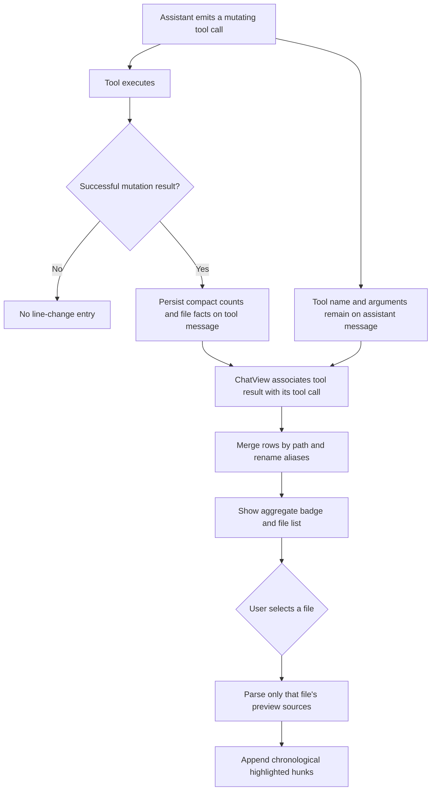

# File line-change preview

This document describes the architecture and semantics of the `+N -N` file
change badge and its highlighted preview modal. The preview is an operation
history assembled from successful LC file-tool calls. It is not a filesystem
snapshot. It is also not a net difference between the start and end of a turn.

## Goals

- Show which files a single assistant turn changed.
- Combine repeated operations on the same logical file into one file row.
- Follow rename chains so a rename and a later edit remain one row.
- Highlight the text supplied to mutating tools without storing additional
  copies of complete files.
- Keep conversation persistence compact and upgrade older messages without a
  data migration.
- Parse large patch arguments only when the user selects the corresponding
  file in the modal.

## Non-goals

The current implementation does not:

- compute a baseline-to-final unified diff
- retain before-and-after filesystem snapshots
- assign original or resulting file line numbers to highlighted lines
- reconcile overlapping, repeated, or reverted edits into one net change
- detect mutations performed by shell commands, external programs, or the
  user outside the three tracked file tools
- guarantee that the highlighted preview matches the file currently on disk.

## Tracked tools

Only the three names in `FILE_IO_MUTATING_NAMES` contribute changes:

| Tool | Persisted facts come from | Highlight preview comes from |
|---|---|---|
| `lc_write_file` | Successful result entries and their line counts | `files[].content` in the tool arguments |
| `lc_edit_file` | Successful result entries where `replaced === true` | `old_string` and `new_string` in the tool arguments |
| `lc_apply_patch` | Successful `files[]` result entries and their line counts | The patch text in the tool arguments |

Read-only file tools and `lc_run_shell` do not participate. A shell command can
modify a file, but that mutation will not appear in this preview.

## Data flow



The two inputs have different responsibilities:

1. Tool results are authoritative for whether a mutation succeeded and for
   the reported added/removed counts.
2. Tool arguments provide the text displayed in the highlighted preview.

The modal does not reread files to build highlights.

## Persisted data

Each successful tool result can persist the following fields on its
`role: 'tool'` message:

```typescript
tool_lines_added?: number;
tool_lines_removed?: number;
tool_line_changes?: Array<{
  path: string;
  added: number;
  removed: number;
  moveTo?: string;
  changeType?: 'added' | 'modified' | 'deleted' | 'renamed';
}>;
```

This is the compact change summary used by the badge and file list. Highlight
hunks are not added to newly persisted summaries.

The assistant message already persists its normal tool-call record, including
the tool name and arguments. Consequently, the source text needed to rebuild a
preview is normally available after reload without storing another copy.

This has an important storage nuance: LC does not create a file snapshot, but
some tool arguments can contain substantial file content:

- `lc_write_file` may contain the complete content being written
- `lc_apply_patch` contains the complete submitted patch
- `lc_edit_file` contains the submitted old and replacement strings.

That content exists because it was the tool input, not because the preview
captured the filesystem.

## Transient preview recipes

`ChatView` walks the conversation in message order. It associates each tool
result with the matching assistant `tool_calls` record through `tool_call_id`.
For each factual file entry, it creates a transient
`previewSources` recipe containing:

- tool name
- original tool arguments
- completion timestamp of the matching tool-result message
- path and optional rename destination
- reported added/removed counts
- inferred change type.

These recipes exist in the derived React state. They are not written back to
the conversation. The modal calls `materializeFileChangePreview()` only for
the selected file, avoiding eager parsing of every patch whenever the chat
renders again or streams another token.

Each materialized hunk is tagged with the exact LC tool name and the matching
tool-result message's completion time. The hunk header renders that provenance
as a tool badge and localized date/time. This reuses the message timestamp
already stored by the conversation model. It does not introduce a new
persistent timestamp or file snapshot.

## Per-tool preview semantics

### `lc_edit_file`

For an existing file, LC creates one `Replacement` hunk:

1. Every line in `old_string` is marked removed.
2. every line in `new_string` is marked added.

For a newly created file, only `new_string` is shown and the hunk is labelled
`New file`.

The tool does not report where `old_string` matched in the original file.
Therefore the preview cannot attach absolute line numbers to the replacement.

### `lc_apply_patch`

LC parses its patch language directly:

- `*** Add File`, `*** Update File`, and `*** Delete File` start file entries
- `*** Move to` records a rename destination
- `@@` starts a displayed hunk and supplies its optional label
- lines beginning with `+`, `-`, or a space become added, removed, or context
  lines.

LC patches intentionally use simplified `@@` markers rather than standard
unified-diff ranges such as `@@ -18,4 +18,6 @@`. The patch therefore supplies
highlightable text but not old/new starting line numbers.

If a patch reports a deletion without carrying the deleted contents, the
modal explains that the previous contents are unavailable.

### `lc_write_file`

LC shows the submitted `content` as added lines:

- append mode uses the label `Appended content`
- other modes use `Resulting content`.

When the operation also reports removed lines, LC notes that the previous
contents were not retained. An overwrite may show the complete resulting
content. It cannot highlight the missing old file unless another operation
supplied the old content.

## File-level merging

`mergeFileLineChanges()` produces one logical row per file. It normalizes path
spelling and maintains an alias map for both `path` and `moveTo`.

Normalization includes:

- converting backslashes to forward slashes for matching
- collapsing repeated separators
- removing a leading `./` and a trailing separator
- case-folding Windows drive and UNC paths while preserving case sensitivity
  for relative and POSIX paths.

Rename aliases remain connected. For example:

```text
old.ts -> new.ts
edit new.ts
```
becomes one row whose current display path is `new.ts`.

When entries merge:

- added counts are summed
- removed counts are summed
- preview recipes and any existing hunks are appended chronologically
- the latest rename destination is retained
- the display change type is combined according to the operation history.

This is a file-identity merge only. The implementation does not merge the
contents of the hunks.

## Stacked hunks, not a final-state diff

Every contributing operation remains visible in chronological order. Consider
two edits in one assistant turn:

```text
retries = 2 -> retries = 4
retries = 4 -> retries = 2
```

The final file matches the initial value, but LC will show both replacements
and count both operations. It does not cancel them out.

The same limitation applies when:

- a later edit changes text introduced by an earlier edit
- a file is created and later deleted
- several patches touch the same lines
- another process modifies the file after the tool completes.

The correct interpretation is:

> One merged file row containing a stacked history of successful LC tool
> operations.

It should not be interpreted as:

> The net difference between the file at the start and end of the turn.

## Counts

The badge totals and per-file counts are operation totals reported by the
tools. They are summed across matching operations. They are not recalculated
from the displayed hunks and are not netted against later reversals.

A pure rename can legitimately report `+0 -0` and still produce a file row.

## Line numbers

Absolute line numbers are unavailable because the preview sources do not
provide a stable baseline position:

- `lc_edit_file` supplies matched text but not the match offset
- `lc_apply_patch` supplies simplified hunks without old/new ranges
- `lc_write_file` supplies content without an original-file mapping.

Inventing line numbers by searching the current file would be unreliable. The
same text may occur more than once, later operations may have shifted it, and
the current file may have changed since the tool ran.

## Current-file view

The modal's `Open file` action opens the selected path through LC's normal file
preview flow. That view represents the file read at open time. It is separate
from the highlighted operation preview:

- highlighted hunks describe recorded tool inputs
- the file view describes current filesystem content.

The two can legitimately differ.

## Limits and fallback behavior

- Each materialized hunk is capped at 500 lines and marked as truncated when
  the source exceeds that limit.
- Malformed or unavailable tool arguments leave the compact file facts intact
  but may produce no highlighted hunk.
- Older stored rows without a `changeType` are rebuilt from their compact tool
  output when possible, avoiding a database migration.
- Preview-unavailable explanations from several operations are combined
  without duplicating identical messages.

## What a true final-state diff would require

A reliable final-state preview needs a known baseline and the resulting file
content. Two viable designs are:

### Git-backed comparison

For repositories, compare the current file against the selected Git baseline
(for example `HEAD`, the index, or a recorded commit). Git provides unified
diff hunks with old and new line ranges.

This produces a repository diff, which may include user or external changes
that were not made by the current assistant turn.

### Turn-scoped baseline

Capture each affected file's content before its first mutation in the turn.
Then compare that baseline with the final file when the turn ends. After LC
generates a unified diff, it can discard the complete temporary baseline. Only
the resulting diff must be persisted.

This produces a turn-specific net diff and supports reliable line numbers. It
requires handling binary files, large-file limits, created or deleted files,
rename chains, failed operations, concurrent external edits, and crash recovery.

Neither design is part of the current implementation.

## Key implementation files

| File | Responsibility |
|---|---|
| `src/modules/tool-engine/registry-names.ts` | Canonical list of the three mutating file tools |
| `src/modules/tool-engine/file-line-changes.ts` | Result summarization, path/rename merging, lazy preview parsing and materialization |
| `src/modules/chat-pipeline/orchestrator.ts` | Persists compact change facts on completed tool messages |
| `src/ui/chat/ChatView.tsx` | Associates tool results with calls and derives per-assistant change state |
| `src/ui/chat/MessageBubble.tsx` | Renders the badge and opens the modal |
| `src/ui/chat/FileLineChangesModal.tsx` | File list, selected-file preview, highlights, and current-file action |
| `src/modules/tool-engine/file-line-changes.test.ts` | Merge and preview regression coverage |

## Invariants to preserve

Future changes should preserve these contracts unless the storage model is
explicitly redesigned:

1. Failed or rejected tool operations never contribute change facts.
2. Compact persisted facts remain sufficient to render the badge and file
   list without parsing tool arguments.
3. Tool arguments are parsed lazily for the selected file.
4. Rename aliases resolve to one logical row.
5. Counts retain operation-total semantics until a real baseline comparison
   replaces them.
6. The UI does not imply that stacked hunks are a canonical final-state diff.
