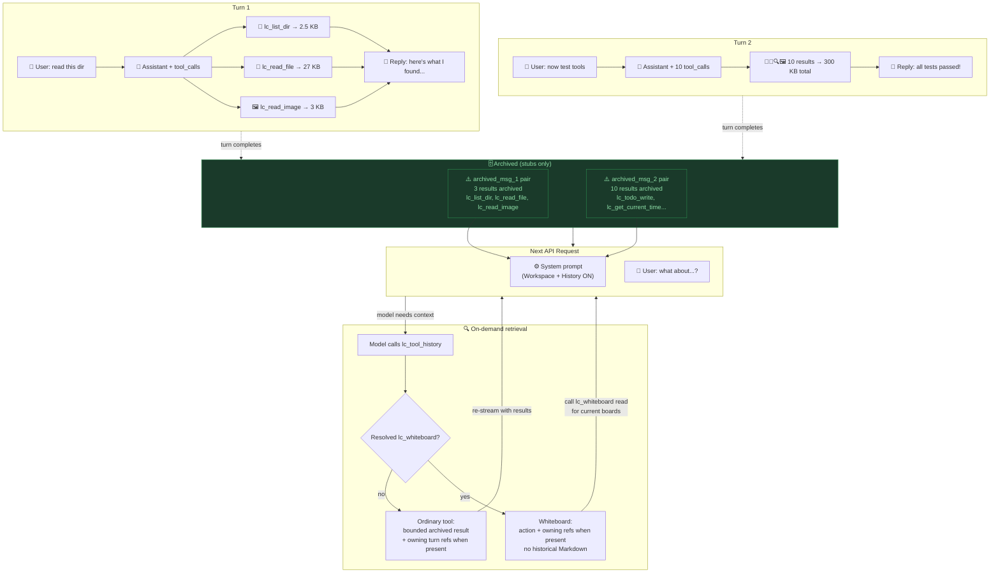
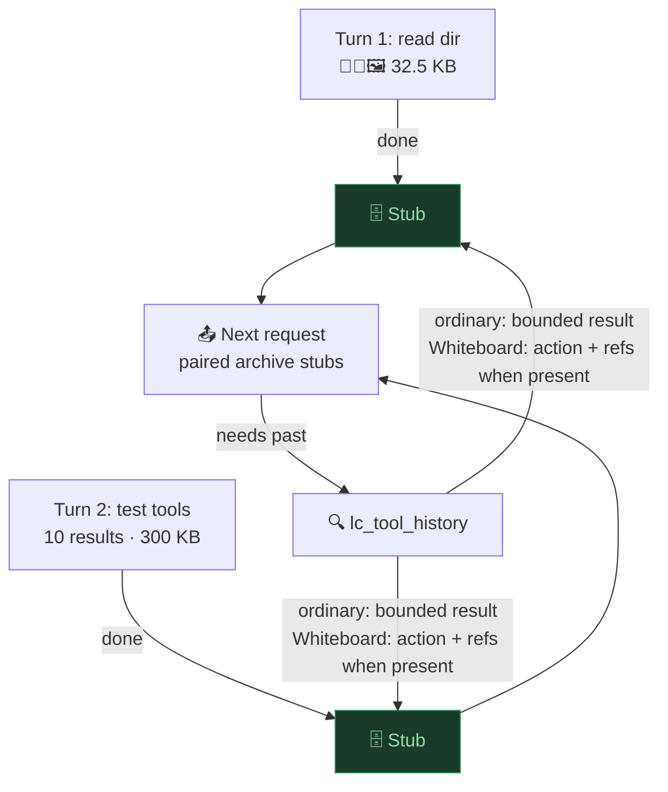

<!--
  Copyright 2026 LC Contributors

  Licensed under the Apache License, Version 2.0 (the "License");
  you may not use this file except in compliance with the License.
  You may obtain a copy of the License at
      http://www.apache.org/licenses/LICENSE-2.0

  Unless required by applicable law or agreed to in writing, software
  distributed under the License is distributed on an "AS IS" BASIS,
  WITHOUT WARRANTIES OR CONDITIONS OF ANY KIND, either express or implied.
  See the License for the specific language governing permissions and
  limitations under the License.
-->

# Tool History — Architecture Diagrams

## 1. Detailed

## 2. Simplified (mobile)

> **Figures in this document are illustrative scenario values**, not
> measurements. Turn 1's 32.5 KB is the sum of its detail rows in §1:
> 2.5 + 27 + 3 KB. Turn 2 uses the scenario from `tool-history.md` §1:
> 10 results × 30 KB per result = 300 KB. The next-request label makes no
> numeric savings claim. If the scenario changes, keep each figure consistent
> with the detailed diagram and feature contract.

The Whiteboard branch is a retrieval privacy boundary, not a storage rewrite.
Canonical local messages and conversation archives retain the original calls
and results. With Tool History off, provider requests also replay those complete
historical Whiteboard exchanges. With Tool History on, archived request turns
use the same generic stubs shown above, and explicit `lc_tool_history`
retrieval returns no board Markdown or mutation payload.
