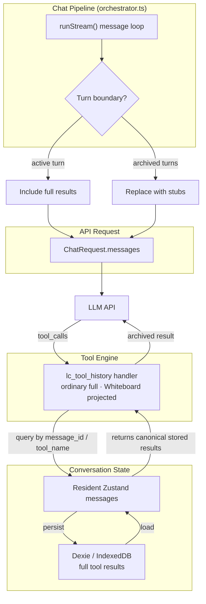
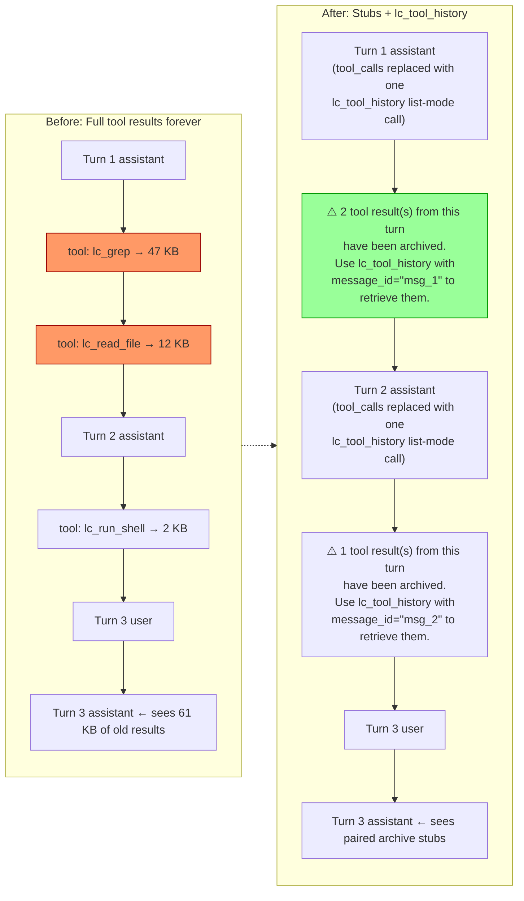
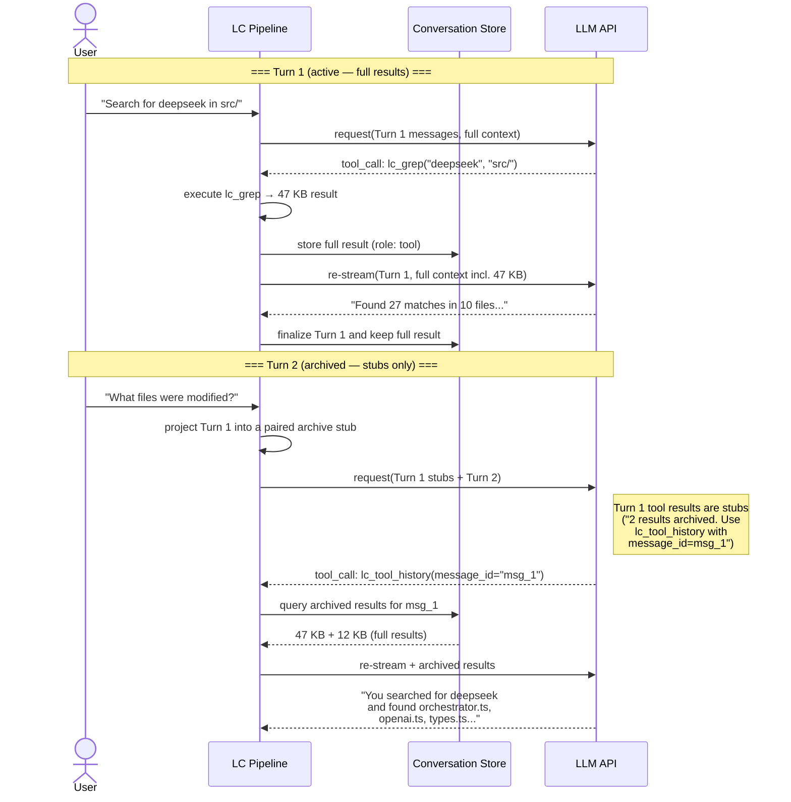

<!--
  Copyright 2026 LC Contributors

  Licensed under the Apache License, Version 2.0 (the "License");
  you may not use this file except in compliance with the License.
  You may obtain a copy of the License at
      http://www.apache.org/licenses/LICENSE-2.0

  Unless required by applicable law or agreed to in writing, software
  distributed under the License is distributed on an "AS IS" BASIS,
  WITHOUT WARRANTIES OR CONDITIONS OF ANY KIND, either express or implied.
  See the License for the specific language governing permissions and
  limitations under the License.
-->

# `lc_tool_history` — Tool Result Archive

**Status:** Implemented  
**Reviewed:** 2026-08-25
**Handler:** `src/modules/tool-engine/builtin/tool_history.ts`  
**Origin:** [llm-tool-history](https://github.com/llm-junkie/llm-tool-history)  

---

## 1. Overview

`lc_tool_history` prevents context growth from cumulative tool results. Without
it, LC stores each tool result in the conversation message tree. LC then sends
the result in **every subsequent API request** for that conversation.

LC replaces results from **completed turns** with small stubs when these
conditions are true:

- Workspace and Tool History are on.
- The provider supports tool calling. Native LM Studio REST does not.

The model receives enough information to identify the previous action. It can
call `lc_tool_history` to retrieve ordinary results or the privacy-safe
Whiteboard projection. If Workspace is off, LC
disables retrieval exposure and stubbing. Thus, LC never instructs the model to
call an unavailable tool. LC always includes the current turn's tool results
in full, including `lc_skill`, `lc_ask_user`, and `lc_whiteboard` results.

If Tool History is off, LC does not archive or replace tool results. Complete
historical Whiteboard arguments and results remain in provider requests like
other explicit tool exchanges. This can replay full boards and consume
substantial context. For history, Skills and Whiteboard remain their own
no-prompt policy categories; neither belongs to Tool History.

### Scope boundary

Tool History compacts completed **tool calls and tool results only**. It does
not summarize, compact, filter, or delete assistant reasoning. Provider-native
reasoning items and thinking blocks remain eligible for replay exactly as they
would with Tool History off. A provider-boundary mismatch can make opaque state
ineligible for a different request. A model change alone is not permission to
drop it when the provider documents cross-model replay; Anthropic says to keep
passing complete blocks and let its API decide compatibility. LC still archives
and sends the eligible carrier; unknown filtering is not inferred from a model
name or converted to zero in context accounting.

### Context Savings

A 5-turn conversation with 10 tool calls per turn, averaging 30 KB per result:

| | Without archiving | With `lc_tool_history` |
|---|---|---|
| Turn 1 context | ~300 KB tool results | ~300 KB (active turn — full) |
| Turn 2 context | ~600 KB (cumulative) | ~1 KB stubs + ~300 KB active |
| Turn 5 context | ~1.5 MB (cumulative) | ~1 KB stubs + ~300 KB active |
| Approximate Turn 5 tool-result tokens | ~375K | ~75K |

---

## 2. Design

### 2.1 Context Split

LC **archives** tool results after their owning turn ends. The model receives
small **stubs** that identify the action. It can call `lc_tool_history` to
retrieve ordinary full results. Archived Whiteboard retrieval returns only the
action and owning turn references, never historical board Markdown.

```
┌─────────────────────────────────────────────────────────┐
│                    CONTEXT SPLIT                        │
│                                                         │
│  ACTIVE TURN (current user→assistant cycle)             │
│  ┌───────────────────────────────────────────────────┐  │
│  │  All tool results included in full                │  │
│  │  Model needs them mid-reasoning                   │  │
│  └───────────────────────────────────────────────────┘  │
│                                                         │
│  ARCHIVED TURNS (all previous cycles)                   │
│  ┌───────────────────────────────────────────────────┐  │
│  │  assistant messages: use one archive marker call  │  │
│  │  tool messages:      replaced with stubs          │  │
│  │  lc_tool_history:    queryable on demand          │  │
│  └───────────────────────────────────────────────────┘  │
└─────────────────────────────────────────────────────────┘
```

### 2.2 Implementation

Archiving happens in the message-building loop within `runStream()` in
the orchestrator. It is active only when the shared exposure resolver includes
`lc_tool_history`:

1. Pass the current turn's messages without changes, including full tool results.
2. Replace previous turns' tool messages with stubs.
3. Add a synthetic `lc_tool_history` call in list mode (`{}`). Derive its stable
   ID from the assistant message.
4. Add a synthetic tool message. List the archived tool count, `message_id`,
   and tool names.



### 2.3 Message Transformation



---

## 3. API Reference

Full input/output schemas are in [`tool-reference.md`](./tool-reference.md#lc_tool_history).

### 3.1 Stub Format

The format is generic for every archived result, including `lc_tool_help` and
`lc_ask_user`. It keeps the archived result count, assistant message
identifier, and called tool names. It does not keep help guidance, keywords,
matched sections, or ask-user answers. The full answer remains retrievable
through `lc_tool_history`. LC does not add an answer projection or a synthetic
user message after the active turn.

When an archived turn's tool results are replaced with stubs in the API
request, two things happen:

1. The assistant message's `tool_calls` array is **replaced** with a single
   synthetic call:

```json
{
  "id": "archived_msg_abc123",
  "type": "function",
  "function": { "name": "lc_tool_history", "arguments": "{}" }
}
```

This is required for server protocol compliance — every `tool_call_id` in the request must have a matching `role: "tool"` response.

**Why the name must be a real tool.** The name is in the `function.name` slot
of the model's prior turns. Models across families often imitate this strong
transcript signal. An early LC version used a placeholder. Each imitation
caused an `unknown_tool` round trip. One tested frontier model then sent its
complete answer again.

Any name in this slot appears callable, so another placeholder does not help.
The retrieval tool name directs imitation to the intended behavior. It also
prevents LC from naming a tool that is absent from the request's `tools` array.
List-mode arguments make the exchange coherent. The turn requests an archive
index and receives a summary with the `message_id`.

2. A single synthetic tool message is appended after the assistant message:

```
role: "tool"
tool_call_id: "archived_msg_abc123"
content: "⚠️ {N} tool result(s) from this turn have been archived. Use lc_tool_history with message_id=\"{msgId}\" to retrieve them. Tools called: lc_grep, lc_read_file, lc_run_shell."
```

### 3.2 Response Format

```json
{
  "message_id": "msg_abc123",
  "total_archived": 5,
  "returned": 3,
  "truncated": true,
  "truncated_bytes": 48000,
  "coverage_pct": 88.99,
  "results": [
    {
      "tool_call_id": "call_001",
      "tool_name": "lc_grep",
      "arguments": "{\"searches\":[{\"path\":\"src/\",\"pattern\":\"deepseek\"}]}",
      "output": "src/orchestrator.ts:256: // DeepSeek thinking mode...\nsrc/openai.ts:32: const isDeepSeek = ...",
      "output_truncated": false,
      "is_error": false,
      "duration_ms": 45,
      "created_at": 1720335781000
    }
  ]
}
```

### 3.3 Whiteboard reference-only projection

The generic provider-request stub remains the same for an archived turn that
contains `lc_whiteboard`. The special rule applies only when the model later
retrieves that archived call through `lc_tool_history`.

For a resolved Whiteboard call, LC projects:

- `arguments` to the original `action` only (`read`, `replace`, or `edit`);
- `output` to a fixed notice that historical Whiteboard content is redacted;
- the owning assistant message's three `whiteboard_refs` once at the top level
  for `message_id` retrieval, or for exact `tool_call_id` retrieval of any
  result whose owning assistant has those references.

It does not return `content`, `old_string`, `new_string`, `user_markdown`, or
`model_markdown`. List mode and broad search do not repeat references for every
item. Search can match the projected action, tool name, or call ID, but it does
not index board Markdown or mutation payloads. The fixed redaction notice is
also safe searchable output.

```json
{
  "message_id": "msg_whiteboard_turn",
  "whiteboard_refs": {
    "user_board": "u_0822142950012",
    "model_initial_board": "m_0822143055123",
    "model_latest_board": "m_0822143119048"
  },
  "results": [{
    "tool_call_id": "call_whiteboard_replace",
    "tool_name": "lc_whiteboard",
    "arguments": "{\"action\":\"replace\"}",
    "output": "Historical Whiteboard content is redacted. Use whiteboard_refs for retained version IDs, or call lc_whiteboard with action read for the current boards."
  }]
}
```

The references identify retained versions; `lc_tool_history` does not retrieve
their Markdown. The current model can call `lc_whiteboard` to read the boards
visible to its active turn. Canonical local messages and lossless conversation
archives retain the original call and result. This projection does not rewrite
stored history.

Ownership resolution also fails closed. If a stored result has no matching
assistant tool call, LC returns bounded generic metadata with
`tool_name: "unknown"`, empty arguments, and redacted output. It excludes the
unresolved item from every search field so an orphaned payload cannot appear
under an invented name.

---

## 4. Context Flow



---

## 5. Implementation Details

### 5.1 Turn Boundary Detection

A "turn" is defined as one complete user→assistant cycle. The boundary is
detected when building messages for a new API request:

```
Find the most recent user message.
All assistant + tool messages after that user message → ACTIVE (full results).
All messages before that user message → ARCHIVED (stubs).
```

### 5.2 Stub Generation

The message transformation is implemented in `orchestrator.ts`. Stable archive
identities come from `message-history.ts`. The logic:

1. **Detect turn boundary**: find the most recent user message — all
   messages after it are the active turn (full results), all messages
   before it are archived turns (stubs).

2. **Group tool messages**: walk archived messages, group `role: "tool"`
   messages by their owning assistant message (matched by `tool_call_id`).

3. **Replace assistant tool_calls**: each archived assistant's real
   `tool_calls` array is replaced with a single synthetic entry:
   ```json
   { "id": "archived_{escapedAssistantMessageId}", "type": "function", "function": { "name": "lc_tool_history", "arguments": "{}" } }
   ```
   This satisfies the protocol requirement that every `tool_call_id` must
   have a paired `role: "tool"` response.

   The escaping is injective and uses provider-safe characters. It keeps ASCII
   letters, numbers, and `_`. It doubles `-` and encodes other code points as
   `-x{hex}-`. Thus, two different message IDs cannot collapse to one marker.

4. **Append stub tool message**: a single synthetic `role: "tool"`
   message with the same unique `tool_call_id` is pushed after the
   assistant message, containing the archive notice.

5. **Skip archived tool messages**: all original `role: "tool"` messages
   from archived turns are skipped (they are replaced by the single stub).

Stub content format:

```
⚠️ {N} tool result(s) from this turn have been archived.
Use lc_tool_history with message_id="{msgId}" to retrieve them.
Tools called: lc_grep, lc_read_file, lc_run_shell.
```

Note the `(s)` in "result(s)" — the stub handles singular/plural by
using the parenthetical suffix. Tool names are deduplicated via `Set`.

---

## 6. Edge Cases

| Scenario | Handling |
|---|---|
| **Active turn ongoing** | Tool results stay full — model needs them for reasoning |
| **Retry / edit-and-resend** | Truncated messages below the edited point — no archived results to worry about |
| **lc_tool_history called without arguments** | Return bounded structured `summary` entries with message IDs, tool counts, and tool names |
| **`query` supplied** | Bounded lexical search of this conversation's archive only. Every hit carries a real `tool_call_id` for follow-up exact retrieval. Calls without `query` are byte-for-byte unchanged |
| **`query` + `tool_call_id`** | Rejected with an explicit error — search and exact retrieval are mutually exclusive modes |
| **Empty/whitespace optional strings** | Treated as omitted before mode selection, so constrained decoders may safely emit unused fields as `""` |
| **Active turn queried** | Not indexed by the handler. Only completed turns can be searched or retrieved. |
| **Search bound reached** | Partial deterministic results plus `truncation_reasons` and `scan_coverage_pct`. A miss under partial coverage is not a proven no-match. |
| **Single result exceeds max cap** | Truncate valid UTF-8 head+tail to `min(max_result_bytes, 256 KiB)`, set `output_truncated: true` |
| **Total results exceed max_result_bytes** | Return only output bytes that fit, set `truncated: true`, `truncated_bytes`, and `coverage_pct` |
| **message_id not found** | Return `{ message_id: "...", total_archived: 0, returned: 0, truncated: false, results: [], available_message_ids: [...] }` — no `error` field. The id list (max 20) exists because a miss otherwise looks identical to a turn that archived nothing |
| **Model imitates the marker** | Intended: the marker names `lc_tool_history` in list mode, so a copied call returns the archive index |
| **No archived results** | Return `{ results: [], total_archived: 0 }` |
| **Export archive** | Lossless — `conversations.json` still contains full tool results |
| **Whiteboard message/exact retrieval** | Project each Whiteboard item to action-only arguments and a fixed redacted output. Add one top-level `whiteboard_refs` object when the resolved owning assistant has it, including exact retrieval of an ordinary sibling result. Do not return historical Markdown. |
| **Whiteboard list/search** | Do not repeat references. Search uses only the privacy projection and excludes board Markdown and mutation fields. |
| **Unresolved owning call** | Return `unknown`, empty arguments, and generic redacted output. Exclude the item from all search candidates. |
| **Tool History off** | Provider requests replay complete historical Whiteboard calls/results like all other explicit tool history. The reference-only projection is not applied to ordinary replay. |
| **Workspace off** | No stubs are generated and `lc_tool_history` is not exposed |
| **Protocol compliance** | Every archived assistant gets a distinct stable `archived_{escapedMessageId}` call/result pair. The synthetic function name is `lc_tool_history`, which is always exposed wherever archiving runs. |

---

## 7. Search Mode

`query` adds bounded local lexical search over the same archive, implemented in
the pure module `builtin/tool-history-search.ts` so large fixtures can exercise
ranking, snippets, and bounds without mounting a store. The handler owns store
access. The module owns matching.

- **Scope** — the current conversation only. No cross-conversation lookup, no
  network or embedding call, no secondary database or index.
- **Compatibility** — calls without `query` keep their exact schema, semantics,
  and byte budgets. Search adds a separate response shape rather than widening
  the retrieval one.
- **Determinism** — NFKC and locale-independent lowercasing apply separately
  to each code point with its following Unicode combining marks. This does
  not provide whole-string NFKC equivalence, including composition across
  Hangul Jamo. Lexical matching ranks exact id, exact name, exact phrase,
  all-terms, distinct term count, recency, and finally `tool_call_id` order.
- **Honesty** — `eligible_calls`, `scanned_calls`, `scanned_bytes`,
  `scan_coverage_pct`, and `truncation_reasons` always describe what was
  actually examined. Snippets are literal substrings. The search does not
  create content.
- **Whiteboard privacy** — candidates contain only the projected action, tool
  name, call ID, and fixed redaction notice. Board Markdown and mutation
  payloads never become candidates. Unresolved results are excluded entirely.

Full schema, bounds, and rejection rules are in
[`tool-reference.md`](./tool-reference.md#lc_tool_history).

---

## 8. Non-Goals (v1)

- **Summarization / compaction** — stubs are explicit, not AI-generated summaries
- **Token counting for budget** — uses byte caps instead of token caps
- **Cross-session archive** — only within the active conversation
- **User-facing archive browser** — the model drives retrieval. The preview
  overlay already shows tool results for the active message.
- **Embeddings / semantic search** — search mode is lexical only
- **A secondary index or new table** — the first version scans stored data directly

---

## 9. TokenMeter Integration

The `TokenMeter` component (`src/ui/chat/TokenMeter.tsx`) mirrors the
orchestrator's provider capability and archiving decisions so the
context-window gauge reflects the conversation context retained under the
current Tool History state. It is not a completed-response usage meter and it
never substitutes provider `completion_tokens` for stored conversation text.
OpenAI- and Anthropic-compatible profiles count the assembled Workspace policy
and apply Tool History when exposed. Native LM Studio REST counts custom system
instructions only and does not estimate archiving, because that protocol
receives neither Workspace policy nor structured tools.

### 9.1 Idle vs. Streaming

The meter adapts to the conversation state:

| State | `isStreaming` | Boundary | What's counted |
|---|---|---|---|
| **Idle** (viewing chat) | `false` | `conv.messages.length` | Every completed tool exchange is represented by its archive marker and stub. Assistant reasoning and bubble text remain counted. |
| **Streaming** (generating) | `true` | Last user message index | Tool results in the active turn are counted live. Previous turns are archived. |

This means:

- **At idle**: completed tool result bodies and calls are compacted to their
  marker/stub representation. User messages, assistant reasoning, visible
  replies, and refusal text do not disappear.
- **During streaming**: the meter shows the real-time cost of the active
  conversation, including current-turn reasoning, visible reply text, tool
  calls, and tool results as they arrive.

### 9.2 Token Counting

The meter's `computeTokenBreakdown()` function:

1. **Uses** the same resolved Workspace/category exposure as the orchestrator
   and detects whether the conversation is streaming.
2. **Shares** the Tool History ownership/stub projection with the orchestrator;
   request construction and display accounting do not maintain separate
   grouping algorithms.
3. **Skips** archived tool result content entirely — adds their tokens
   neither to I/O nor any other category.
4. **Adds** one synthetic `lc_tool_history` call and one result stub per
   archived assistant-message group to `Help, history & skills`.
5. **Counts** stored assistant `reasoning`, `content`, and `refusal`
   independently. Provider usage and cache counters remain diagnostics below
   the context breakdown and cannot change these rows.
6. **Adds** the current todo projection to User input when the archive marker
   hides the successful source call. A source call that remains in the active
   request is not projected or counted twice.
7. **Counts** unarchived tool-call names/arguments and their results in the
   category derived from the canonical tool policy.

The todo projection is the latest accepted model-authored snapshot. Later tool
work or final assistant text can be newer when the model omitted a final todo
update. Tool History does not infer completion or turn the projection into a
new request; it preserves the snapshot as context only.

The display buckets are:

| Meter row | Content |
|---|---|
| `Foundation tools` | `lc_todo_write`, `lc_ask_user`, `lc_get_current_time` |
| `File I/O & shell` | File I/O policy tools and `lc_run_shell` |
| `Web Access` | Web Access policy tools |
| `Whiteboard` | `lc_whiteboard` |
| `Help, history & skills` | `lc_tool_help`, `lc_tool_history`, `lc_skill`, and every synthetic archive marker/stub |
| `Other tools` | Nonzero-only defensive row for unknown/imported tool names |

These are display buckets only. They do not merge exposure, grants, execution,
or archiving policies. `Replies` is restricted to assistant bubble text
(`content` plus `refusal`); no tool call, result, archive stub, or Preview
overlay projection is a reply.

### 9.3 Example

A 2-turn conversation at idle, with Workspace and Tool History both on:

```
[0] User: "read this dir"
[1] Assistant + tool_calls (lc_list_dir, lc_read_file)
[2] Tool: lc_list_dir → 2.5 KB result
[3] Tool: lc_read_file → 27 KB result
[4] User: "what's in it?"
[5] Assistant + tool_calls (39 tools)
[6..44] Tool results → many retained results
```

At idle, the meter skips archived result bodies and original calls, counts the
synthetic marker/stub representation in `Help, history & skills`, and continues
to count every retained assistant reasoning/reply field. During generation,
the current turn's full calls/results stay in their operational categories.

### 9.4 Provider replay groups

Responses encrypted or provider-returned plaintext reasoning and Anthropic
signed/redacted thinking are bound to response-local replay groups. Tool History
replaces an archived bubble's original calls/results with one synthetic marker
pair, but it does not remove reasoning from conversation context. Responses
keeps both `encrypted_content` and `reasoning_text` reasoning items, plus message
items, while rebuilding the paired function call with the synthetic ID.
Anthropic keeps signed, redacted, and plaintext thinking blocks unchanged while
rebuilding the paired `tool_use` block. The shared projection carries the
reasoning accounting forward with the retained carrier, so TokenMeter and the
wire request remain identical.

Provenance rules remove Anthropic blocks after an endpoint switch. On the same
endpoint, a resolved provider contract permits a model switch. Without a
resolved contract, LC requires the exact source model. The API decides which
preserved blocks it can read. A malformed or missing opaque association is
shown as unmeasured rather than treated as zero. Provider adapters and TokenMeter consume the same
selection, preventing either surface from dropping retained reasoning merely
because Tool History compacted the tool arguments and results around it.

### 9.5 Files

| File | Role |
|---|---|
| `src/ui/chat/TokenMeter.tsx` | `computeTokenBreakdown()` archiving logic, idle/streaming detection |
| `src/modules/chat-pipeline/tool-history-projection.ts` | Shared one-pass call ownership and archive-stub projection |
| `src/modules/chat-pipeline/provider-history-projection.ts` | Provider-native replay-group selection shared by adapters and TokenMeter |
| `src/modules/chat-pipeline/orchestrator.ts` | `runStream()` — applies the shared projection to API requests |
| `src/ui/chat/ChatView.tsx` | Resolves provider capability before system-token memoization and passes it to `TokenMeter` |
